# Splunk - list of components

## Fields

Fields are data extracted from a log. We extract them by using regexes with named capture groups (`\s(?<name>\w*)\s`) in the field extraction tab. We can then use these fields in searches. The sequence of search-time operations should look similar to this:

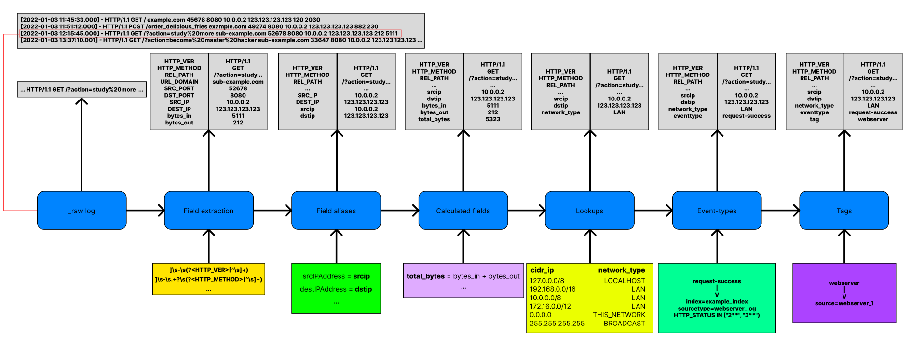

### Field aliases

Field aliases is just an alternative name list for fields in events with a particular sourcetype, source or host. An alias can only have one field, but a field can have multiple aliases.

The field alias occurs at search time, not index time, meaning that logs are not modified in any way using this method.

We use field aliasing in the following scenarios:

- You use Log Observer Connect to get logs, but don't have access to Log Observer Pipeline Management.
- You do not want to use additional resources at index level by transforming data with log processing rules.
- You want the new alias to affect every log, regardless if the log was created before creating the alias.

It is preferred to name field aliases using a CIM model. Here are the steps in making a field alias:

1. Click on Settings -> Fields.

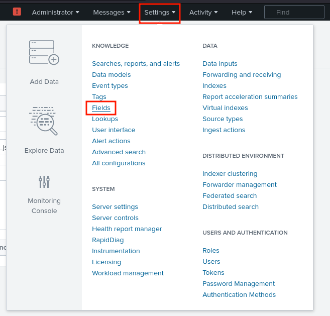

2. Click on "Add new" in "Field aliases" tab.

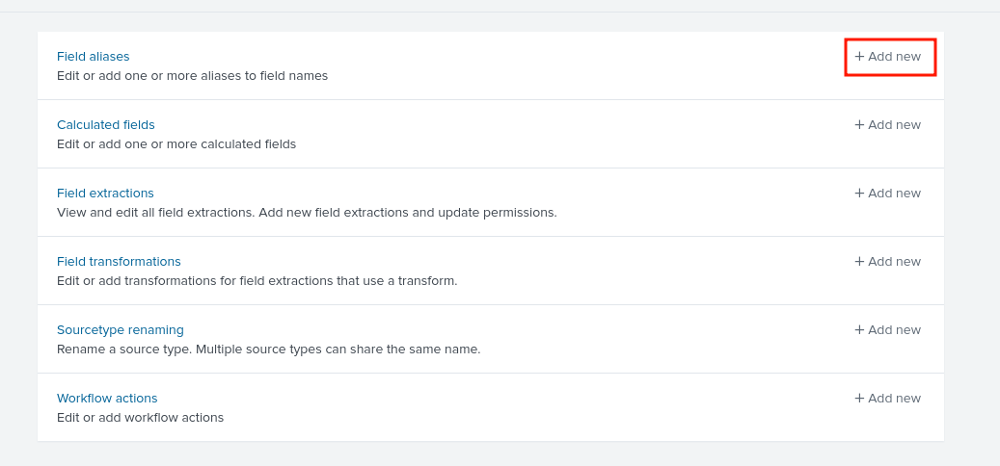

3. Fill out the form with relevant information.

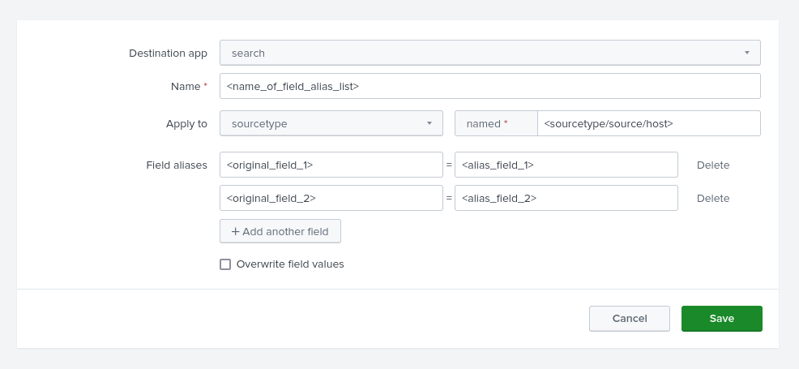

#### Links
- [Youtube - Splunk Basics: Field Alias](https://www.youtube.com/watch?v=wBoropxGMPw)
- [Splunk - Create field aliases](https://docs.splunk.com/Observability/logs/alias.html)
- [Youtube - Splunk Field aliases](https://www.youtube.com/watch?v=A_dDxJww9b0)
- [Splunk - Search-time operation sequence](https://docs.splunk.com/Documentation/Splunk/8.0.6/Knowledge/Searchtimeoperationssequence)

### Calculated fields

Calculated fields are fields that can use eval expressions with other fields to generate a new field. An example would be having 2 fields, "bytes_in" and "bytes_out" and generating a calculated field called "total_bytes", which would have the eval expression of "bytes_in + bytes_out".

Here are the steps of making a calculated field:

1. Click on Settings -> Fields.

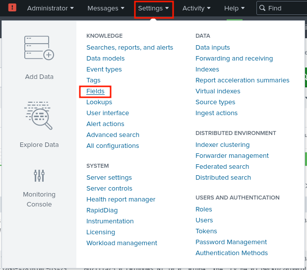

2. Click on "Add new" in "Calculated fields" tab.

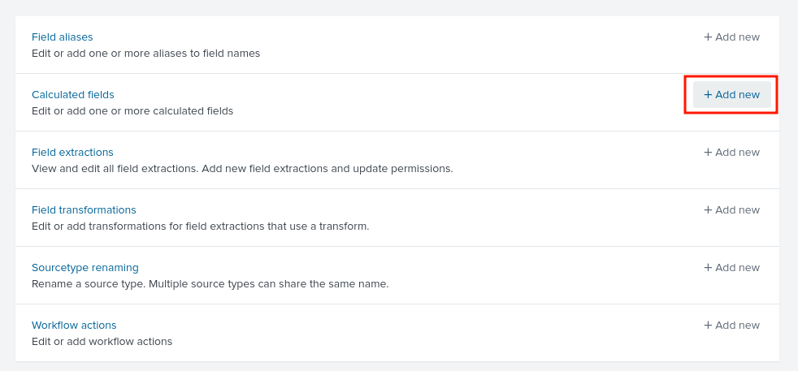

3. Fill out the form with relevant information.

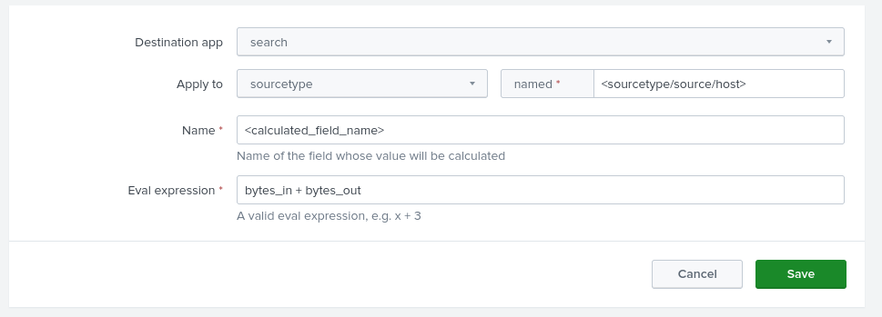

### Field extractions

Field extraction is the first operation when returning search results. They are used to parse matched logs and can be created by using one of three methods:

- Automatic extraction.
- Using regular expressions (regex).
- Editing `props.conf` and/or `transform.conf`.

#### Automatic extraction

Automatic extractions are extractions that are generated purely by splunk. It can be generated when logs have key-value pairs or has a common delimiter. Splunk can also generate a regular expression for the fields being extracted, but it is preferred to manually create regexes using an online tool like [regex101](https://regex101.com/).

#### Using regular expressions

We can also create our own field extractions by using regexes. This is how my process looks like:

1. Search for events to be parsed.

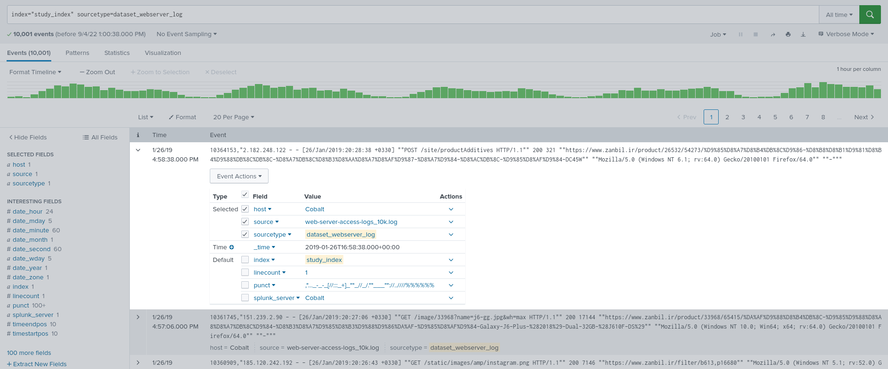

2. Open up [regex101](https://regex101.com/).

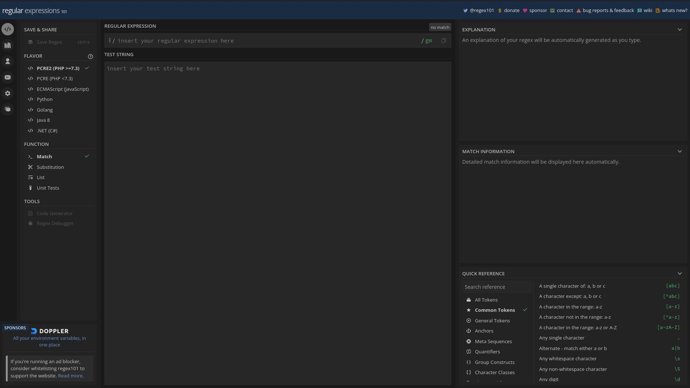

3. Copy and paste a couple of logs from splunk into regex101, seperating them with a newline.

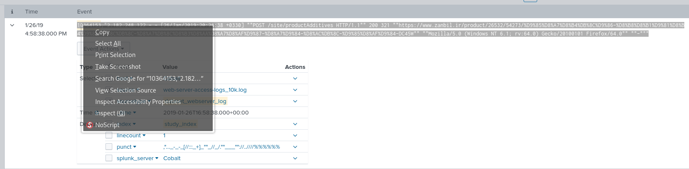

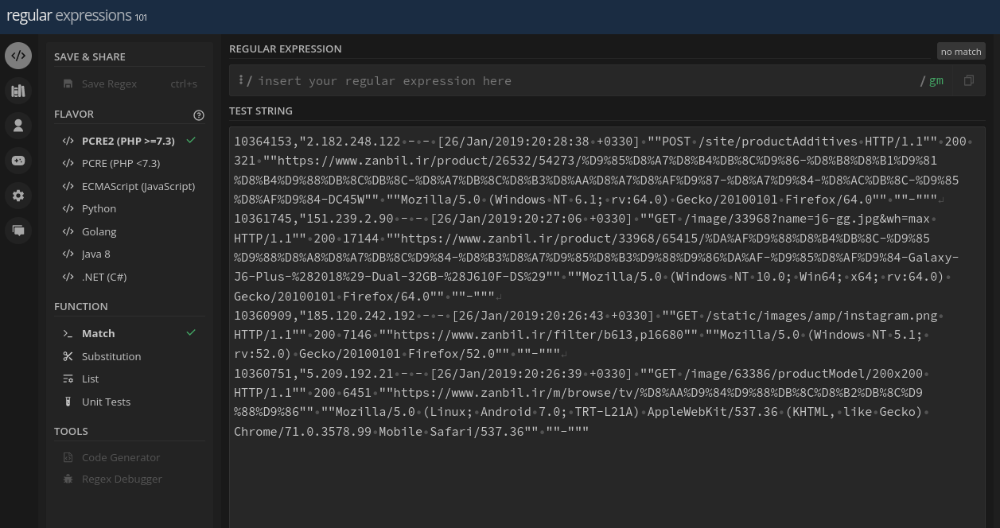

4. Create a regex which matches all the pasted logs and extracts substrings using named capture groups.

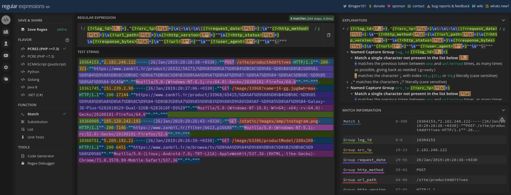

5. Click on an event -> Event Actions -> Extract Fields.

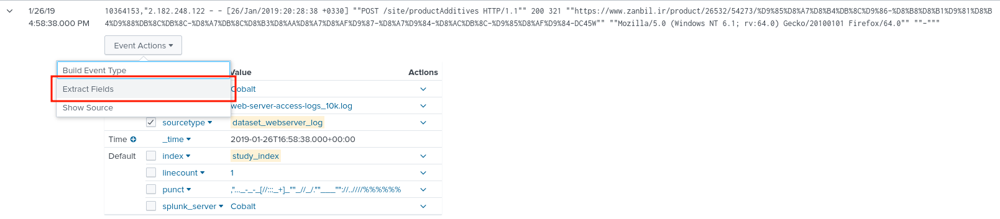

6. Click on the "I prefer to write the regular expression myself" option.

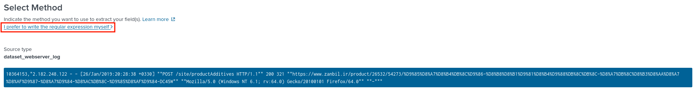

7. Input your regular expression into the textbox and click on "Preview".

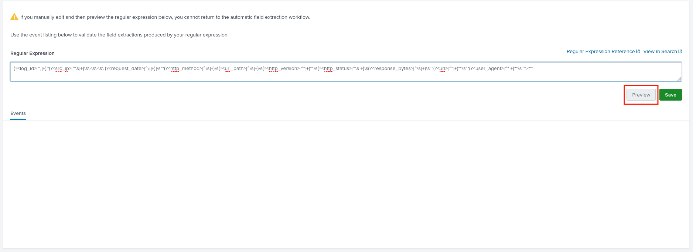

8. Check if fields get successfully extracted and check the values of the extracted fields. You can also set the time-range to 24 hours to get results that can also be incorrectly parsed.

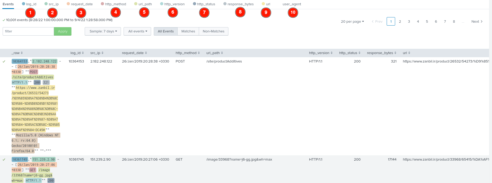

9. Click on "Non-Matches" and see if there are results; if not, skip step 10.

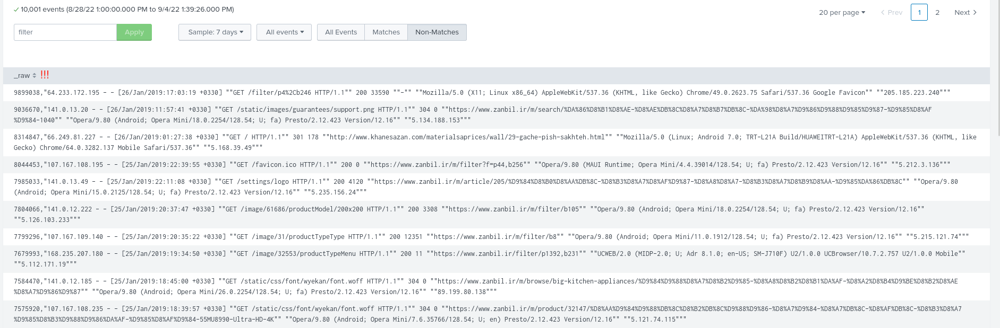

10. If "Non-Matches" show results, go back to step 3 until there are no more results left in "Non-Matches". Copy the ones that do not match the regex.

11. After checking if everything parsed correctly, click on "Save".

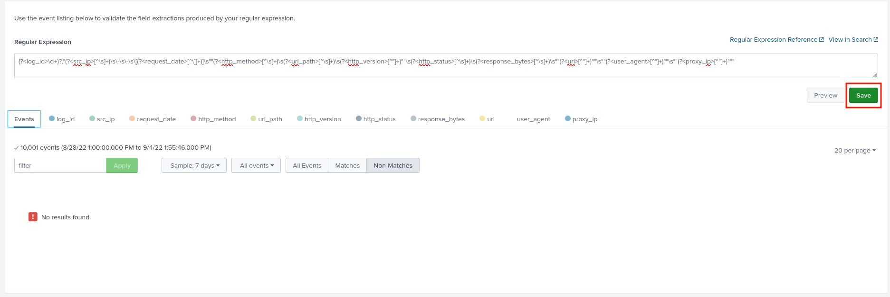

12. Set the relevant permissions and click "Finish".

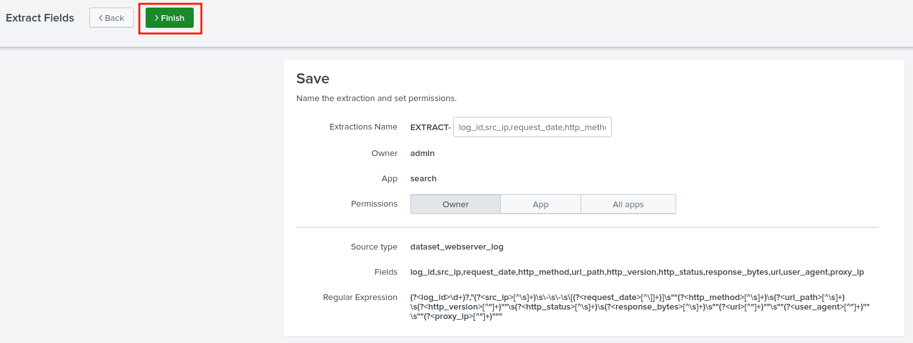

#### Links
- [Splunk - Search-Time Field Extractions](https://docs.splunk.com/Documentation/SplunkCloud/8.2.2203/Knowledge/Managesearch-timefieldextractions)
- [Youtube- Splunk Search-Time field extraction](https://www.youtube.com/watch?v=zIjeCYafLCE)

### Field transforms

Field transformations can be configured in "`transforms.conf`" and "`props.conf`", as well as in the Splunk web GUI. It is a bit more advanced field extraction method compared to inline field extraction, but you are able to use multiple regular expressions for one sourcetype using this method. It is very useful when having one sourcetype with multiple types of log formats or when you have multiple sourcetypes with one log format.

#### Field transforms using GUI

# TODO

### Workflow actions

### Sourcetype renaming

## CIM

### What is CIM

## Data models

### What is a data model

### Types of datasets

### Pivots

### Data model acceleration

## Search optimization

### Tstats

### TERM()

### fields vs table

### transaction vs stats

### Data model acceleration

## Indexers

### Index forwarding

## Apps

### What are apps for?

## Sharing permissions

## How does a search work?

## Other questions

### What are tags used for

### What are eventtypes used for

### What are lookups for

### What are macros for

### Can splunk be used as an IDS?

### What do these commands do

- eventcount / eventstats

### CLI

### props.conf

- You can use this file to create new field aliases

### debug/refresh

## Log Observers

## Recommendations