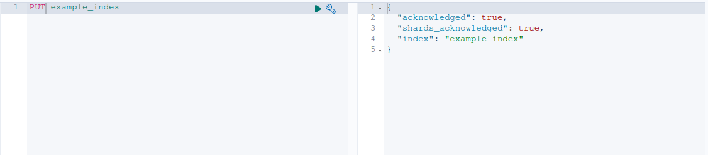
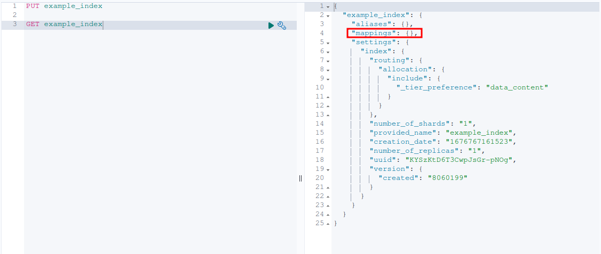
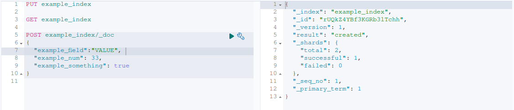
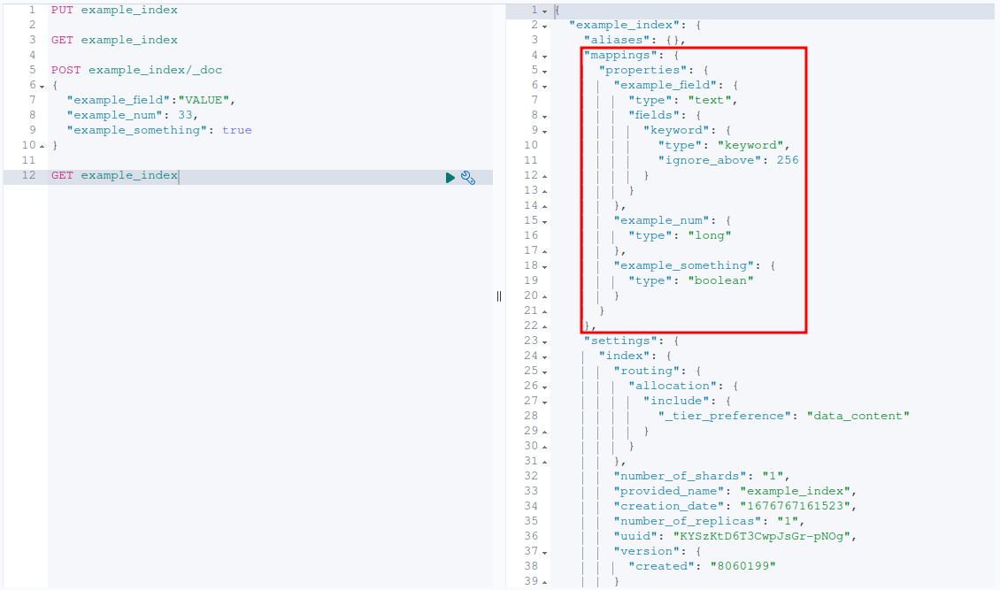

# Elasticsearch

## What is elasticsearch?

Elasticsearch is a search server an in some sense, a NoSQL database.

## Indexes

An index is a collection of documents which have a defined mapping of fields. 

## Dynamic mapping

When creating a new index, there is no field mapping provided to the new index, except for ECS. When we create a new document in our index, Elasticsearch parses the document and provides a mapping for the fields. Here is an example:

If we first create a new index using `PUT example_index`:

We can see that there will be no mapping created for the index:

But if we create a new document with custom fields, like this for example:

We now get a newly generated list of field mappings that are assigned to the field names we provided in the previous document:

## Ingest Pipelines

Ingest pipelines are a way to format and enrich data before indexing. You can remove, modify, add and extract fields from text provided by a data source. Every operation on data is managed by a processor. Each processor runs in sequence, and after all processors finished running, the newly formatted data is added to an index.

### Processors

Processors are functions that change the original document in some way before it gets indexed, for example:

- It can append data.
- It can extract data.
- It can append data to arrays.
- And much more.

You can find the whole list [here](https://www.elastic.co/guide/en/elasticsearch/reference/current/processors.html).

## Resources

- https://www.youtube.com/watch?v=i7BqJgFiLis
- https://www.elastic.co/guide/en/elasticsearch/reference/current/rest-apis.html
- https://www.elastic.co/guide/en/elasticsearch/reference/current/cat-indices.html
- https://www.tutorialspoint.com/elasticsearch/index.htm