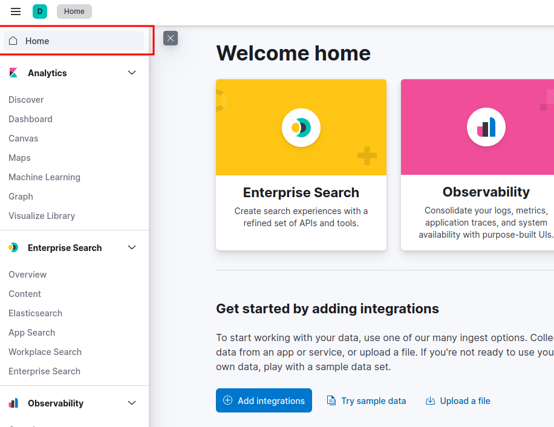
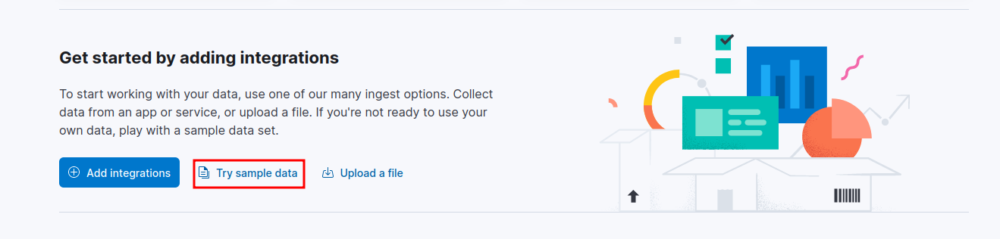
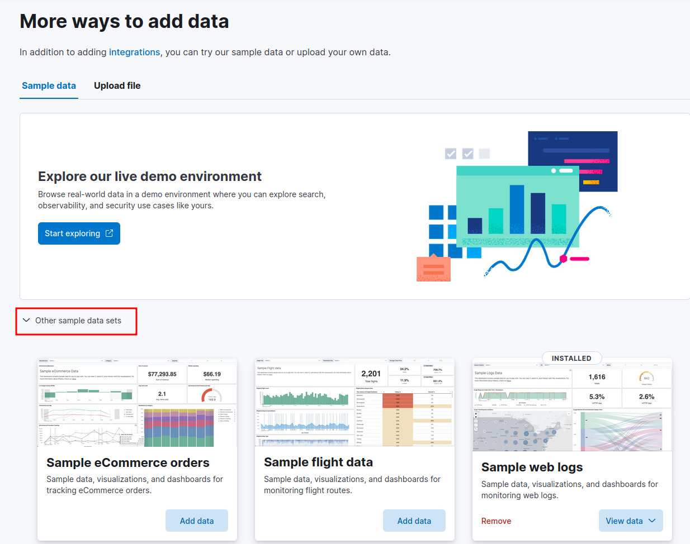

# Manually adding data into Kibana

There are two ways you can add data to Kibana, depending on what you want to do. The first option is providing test or sample data which is provided by elasticsearch. To do this, you need to:

1. Login to Kibana and click on "Home".

2. Click on the "Try sample data" option.

3. Click on "Other sample data sets".

Here, you should have a couple options to pick from. You can start your journey from here.
