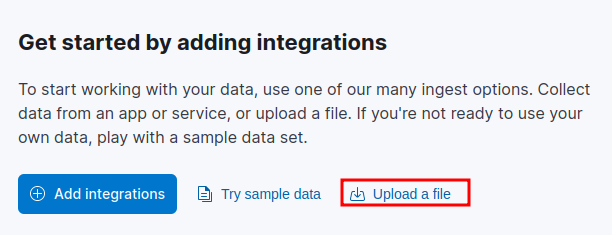
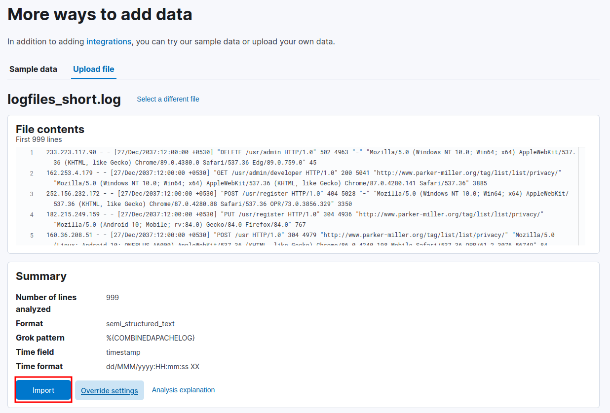
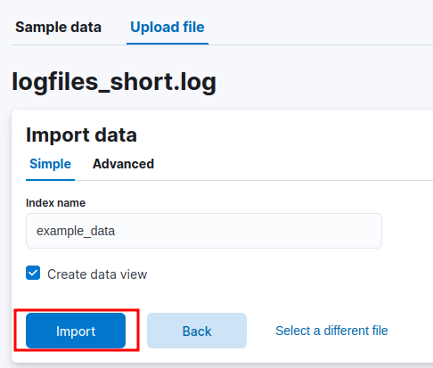

# Manually adding data into Kibana

There are two ways you can add data manually to Kibana, depending on what you want to do. 

## Sample data provided by Kibana
The first option is providing test or sample data which is provided by elasticsearch. To do this, you need to:

1. Login to Kibana and click on "Home".

2. Click on the "Try sample data" option.

3. Click on "Other sample data sets".

Here, you should have a couple options to pick from. You can start your journey from here.

## Custom data provided by the user

The second option is to add the data yourself. To achieve this, you:

1. Login to Kibana and click on "Home".

2. Click on the "Upload a file" option.

3. Drag and drop or select the file you want to analyze.

4. Check if the grok pattern works for your data and hit "Import".

5. Provide a new name for the index and hit "Import".

You can now view and analyze the data in the "Discover" tab.