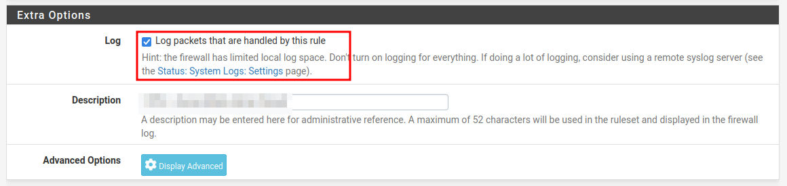
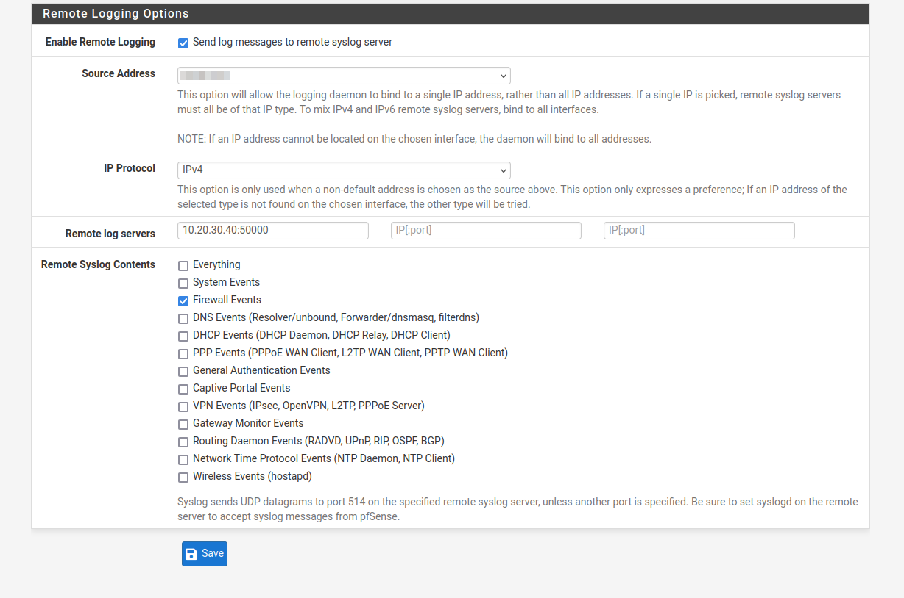
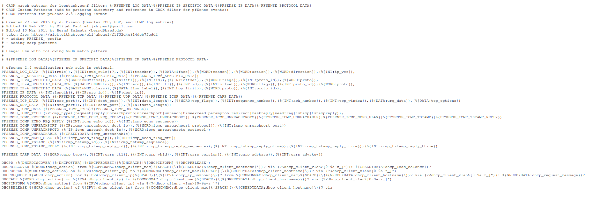
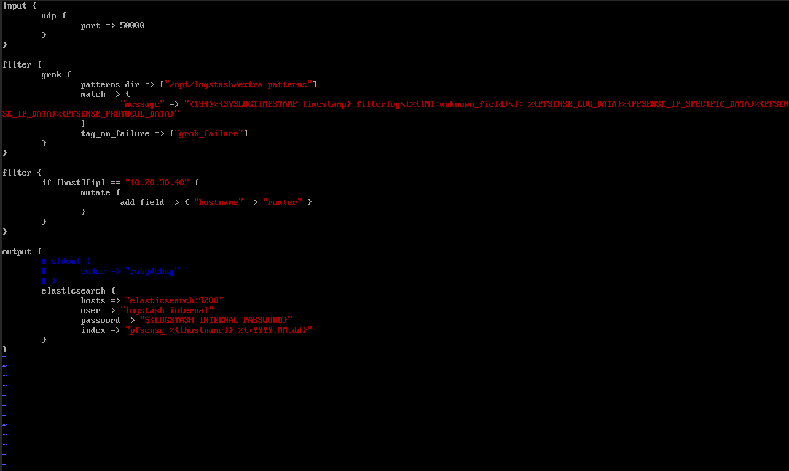
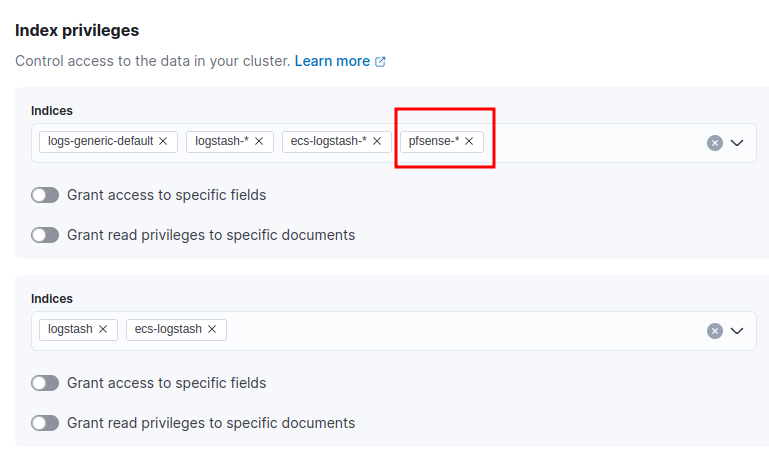
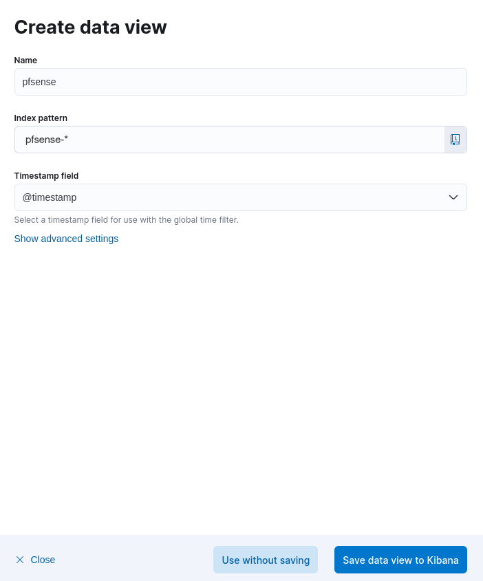

# Collecting logs from PfSense syslogs

1. Configure firewall rules to monitor.

2. Enable remote logging, configure the contents and point to the logstash instance (for this example, we will only enable firewall events).

3. Download the grok patterns from https://github.com/patrickjennings/logstash-pfsense/blob/master/patterns/pfsense2-4.grok and save it in a folder where logstash can access it.

4. Configure the logstash pipeline.

5. Restart logstash.

6. Add required permissions for the logstash user.

7. Create a data view to analyze the data.

