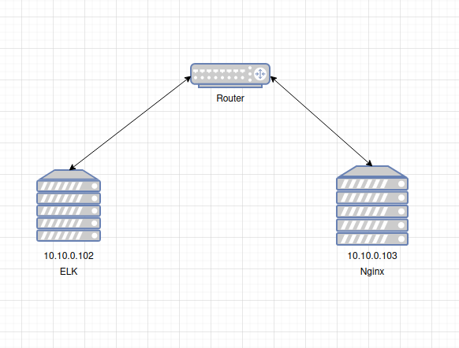
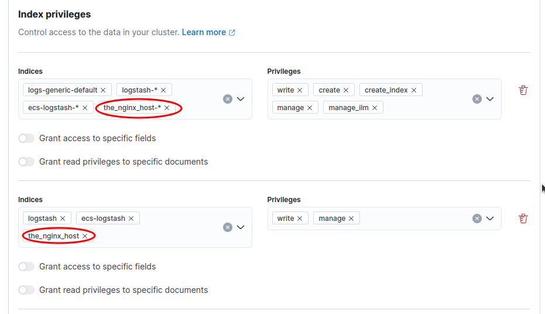
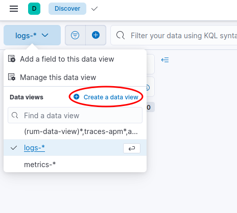
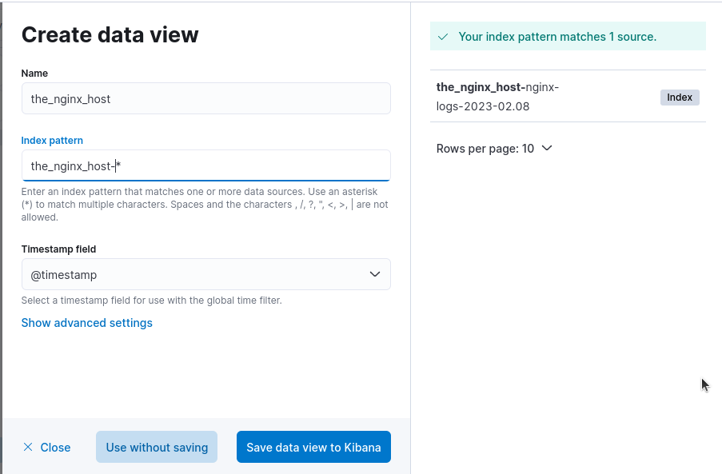
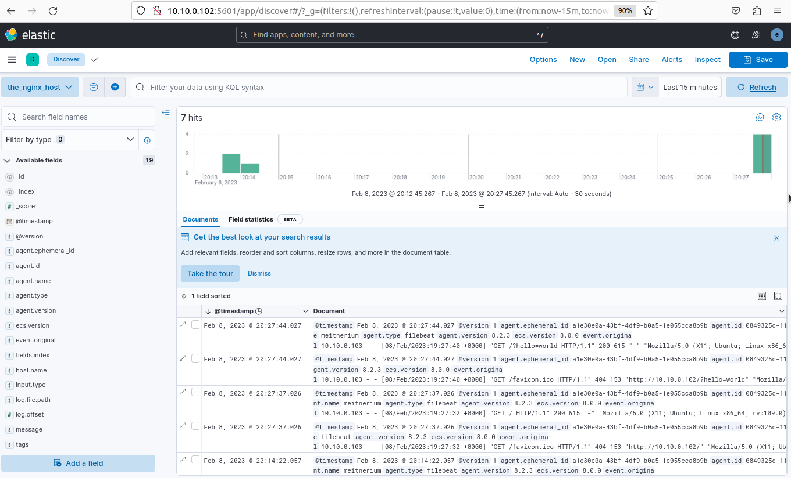

# ELK - Setting up indexes

Indexes are a way to filter data from a data stream into one place. You can categorize indexes however you like, here's a couple of examples:

- By host.
- By group of hosts.
- By service.
- And more!

## Setting up by host

Here is one specific way to configure indexes by host for this network:



### Setting up logstash on 10.10.0.102

After we setup ELK on the machine, we create or modify the existing pipeline to this:

```
input {
    beats {
        port => 5044
    }
}

output {
    if [@metadata][beat] and [fields][index] {
        elasticsearch {
            hosts => "elasticsearch:9200"
            index => "%{[@metadata][beat]}-%{[fields][index]}-%{+YYYY-MM.dd}"
        }
    } else {
        elasticsearch {
            hosts => "elasticsearch:9200"
        }
    }
}
```

Let me explain each component of this configuration:
- `input` - This is the place where you configure what kind of data and from where will arrive to logstash.
- `beats` - This is the plugin for `beats`, this can be `filebeat`, `packetbeat` and more.
- `output` - This is where you configure where the data should go.
- `if [@metadata][beat] and [fields][index]` - This just checks if the field `@metadata.beat` exists and if `fields.index` exists. Both fields are configured inside `filebeat`.

### Setting up Filebeat on 10.10.0.103

After we setup nginx, we install `filebeat` and give it the following configuration:

```
filebeat.inputs:
    - type: log
    paths:
        - /var/log/nginx/access.log
    fields:
        index: nginx-logs
output.logstash:
    hosts: ["10.10.0.102:5044"]
    index: the_nginx_host
```

- `filebeat.inputs` - Configures the data sources to be forwarded.
- `fields` - This is a map that can hold custom variables. I created `index: nginx-logs` to be used in the logstash configuration - this will be shown in logstash as `[fields][index]`.
- `output.logstash` - Configures where the data should be forwarded.
- `index: the_nginx_host` - This will be shown in the `logstash` configuration as `[@metadata][beat]`.

### The `action [indices:admin/auto_create] is unauthorized for user [x]` error

To solve this error, simply:

- Login to Kibana.
- Go to `Management > Stack Management > Roles`.
- Pick the logstash role used for `logstash`.
- Add indices like so:



- Click `Update role`.

This should allow `logstash` to append data to the configured indices.

### Adding a data view

To add a data view:

- Go to `Analytics > Discover`.
- Click on the following element:



- Create a data view by giving it a custom name and - for this configuration - the following pattern: `the_nginx_host-*`.



### Results

The result of the above configurations should look like this:

