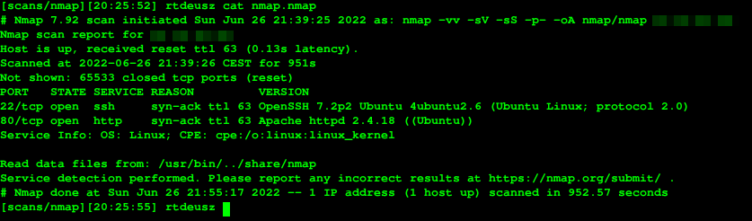
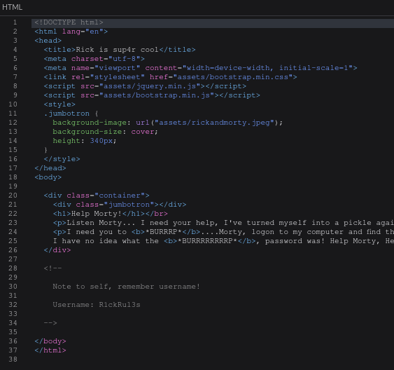
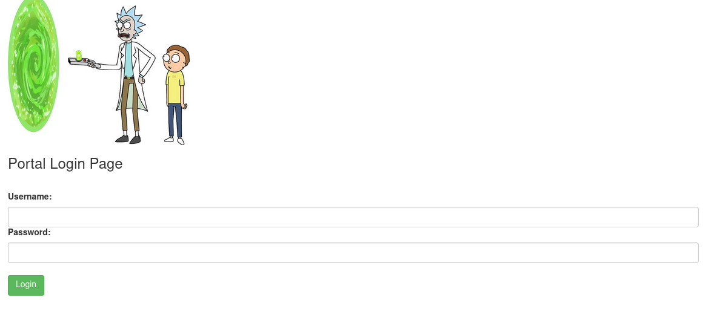
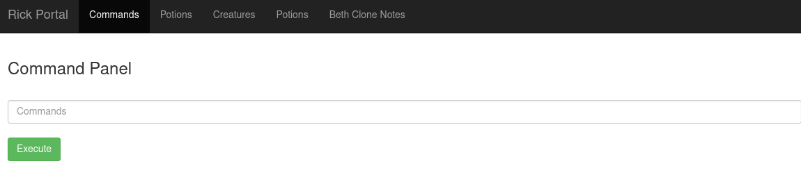
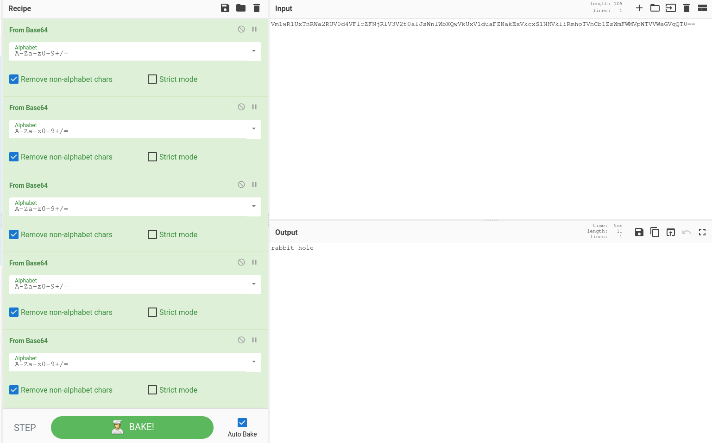
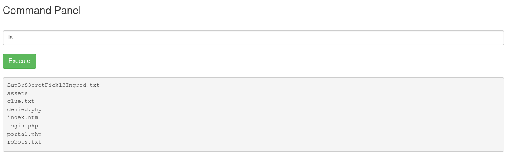
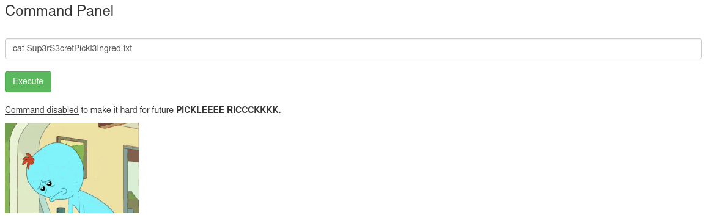
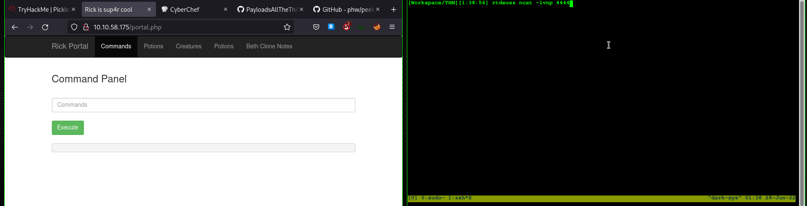

# Pickle Rick
The Pickle Rick room tests the player on how well he uses collected information to his advantage. This is how I solved the room (I did overcomplicate it in the end though).

## Scanning the machine
Firstly, I have used `nmap -vv -sV -sS -p- -oA nmap/nmap 10.xxx.xxx.xxx` to find all open ports and potential services that run on those ports. These are the results:



We have 2 ports open: 80 and 22.

## Manual website inspection
On the main page of the website, I have found a comment which has a username:



I also found a string saying `Wubbalubbadubdub` after accessing `/robots.txt` and a couple of files in `/assets/`. I used `exiftool` on all images hoping to find clues in the metadata of the images, but to no avail.

## SSH?
I attempted to try to login with the information that I have to SSH using `R1ckRul3s` as the username and `Wubbalubbadubdub` as the password, but unfortunately, a public key is needed to login.

## Directory brute forcing
The next thing I have done is use `dirsearch` to find other files or directories. I have used this command `dirsearch -u <MACHINE_IP> -w /path/to/SecLists/Discovery/Web-Content/dirsearch.txt` to find a couple of files, including `login.php`.

## Login portal
I was greeted with a login portal with a username and password field:



After inputting `R1ckRul3s` as the username and `Wubbalubbadubdub` as the password, I logged in successfully:



I was redirected to `portal.php`. Other 

## The rabbit hole
When inspecting the source code in `portal.php`, I discovered a comment with `base64` output. After the first base64 decode, the output I got was another base64 string. After decoding the output several times, I got the following string:



## The Command panel
The command panel consists of a text field and a button that says `Execute`. If one tried to input `ls`, which is a bash command for listing contents of the current working directory, it would output the following content:



I tried to `cat Sup3rS3cretPickl3Ingred.txt`, but I was instead greeted with an error:



To bypass this, I thought of a couple of ways to read the file (one of which is the simplest and I did not think of it):

- Using `echo "$(<file.txt)"`, but that for some reason did not work.
- Using `base64 file.txt`, which worked :D.
- Accessing it from the browser (I did not think to do that for some reason)

I used `base64 Sup3rS3cretPickl3Ingred.txt` and recieved the following output: `bXIuIG1lZXNlZWsgaGFpcgo=`, which base64 decoded, is our first ingredient. The next thing that came to mind is to check the source code of the other php files, so I can know if the "command disabled" prompt is purely in php, or if it works in some other way.

This is the decoded output of `portal.php`
```php
<?php
session_start();

if($_SESSION["login"] == false) {
   header("Location: /login.php"); die();
}

?>
<!DOCTYPE html>
<html lang="en">
<head>
  <title>Rick is sup4r cool</title>
  <meta charset="utf-8">
  <meta name="viewport" content="width=device-width, initial-scale=1">
  <link rel="stylesheet" href="assets/bootstrap.min.css">
  <script src="assets/jquery.min.js"></script>
  <script src="assets/bootstrap.min.js"></script>
</head>
<body>
  <nav class="navbar navbar-inverse">
    <div class="container">
      <div class="navbar-header">
        <a class="navbar-brand" href="#">Rick Portal</a>
      </div>
      <ul class="nav navbar-nav">
        <li class="active"><a href="#">Commands</a></li>
        <li><a href="/denied.php">Potions</a></li>
        <li><a href="/denied.php">Creatures</a></li>
        <li><a href="/denied.php">Potions</a></li>
        <li><a href="/denied.php">Beth Clone Notes</a></li>
      </ul>
    </div>
  </nav>

  <div class="container">
    <form name="input" action="" method="post">
      <h3>Command Panel</h3></br>
      <input type="text" class="form-control" name="command" placeholder="Commands"/></br>
      <input type="submit" value="Execute" class="btn btn-success" name="sub"/>
    </form>
    <?php
      function contains($str, array $arr)
      {
          foreach($arr as $a) {
              if (stripos($str,$a) !== false) return true;
          }
          return false;
      }
      // Cant use cat
      $cmds = array("cat", "head", "more", "tail", "nano", "vim", "vi");
      if(isset($_POST["command"])) {
        if(contains($_POST["command"], $cmds)) {
          echo "</br><p><u>Command disabled</u> to make it hard for future <b>PICKLEEEE RICCCKKKK</b>.</p>";
        } else {
          $output = shell_exec($_POST["command"]);
          echo "</br><pre>$output</pre>";
        }
      }

    ?>
    <!-- Vm1wR1UxTnRWa2RUV0d4VFlrZFNjRlV3V2t0alJsWnlWbXQwVkUxV1duaFZNakExVkcxS1NHVkliRmhoTVhCb1ZsWmFWMVpWTVVWaGVqQT0== -->
  </div>
</body>
</html>
```

We can see that the website checks if any of the array strings in `$cmds` are contained inside our command string, we get an error. That's why we also get the error when trying to use the `netcat` command inside our text field. 

I wanted to get a reverse shell so I could do stuff a bit faster, so I used [a reverse shell from PayloadsAllTheThings](https://github.com/swisskyrepo/PayloadsAllTheThings/blob/master/Methodology%20and%20Resources/Reverse%20Shell%20Cheatsheet.md) (python3), modified it and created a listener with `ncat -lvnp 4444`:



After I got the shell, I searched the filesystem manually. I have found a file in `/home/rick/` which contains the second ingredient.

The last ingredient probably is in the `/root` directory, which with our current account, we can't access. To find privilege escalation methods, I used a `linPEAS` shell script and executed it in `/tmp`. I have noticed in the output of the script, `www-data` has `(ALL) NOPASSWD: ALL` permissions enabled in the sudoers file, meaning that we are able to use any command as root. I attempted to `sudo su` and escalateqd privilege to `root`. I  `cd ~` as root to get the 3rd ingredient.
